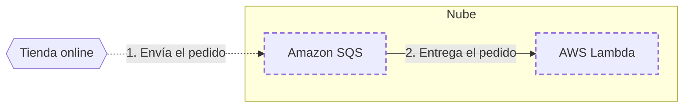

<!-- Archivo generado por pnpm content:gen a partir de scenario.yaml. No se edita a mano. -->

# Pedidos de impresión de fotos

> ⚠️ **Spoilers:** esta ficha contiene las respuestas del escenario. Si lo querés jugar, no sigas leyendo.

Los pedidos llegan en ráfagas y se procesan de a uno sin perder ninguno.

| Campo | Valor |
|---|---|
| Id | `photo-queue` |
| Versión | 1 |
| Estado | published |
| Nivel | 200 |
| Áreas | `serverless` |
| Duración estimada | 5 min |
| Autores | @blueprint-e2e |
| Paleta | auto · extra: Amazon EFS |

## Contexto

Un laboratorio recibe pedidos de impresión desde una tienda online.

## Objetivos

| Id | Tipo | Categoría | Objetivo |
|---|---|---|---|
| `no-servers` | Restricción | operations | No administrar servidores. |
| `no-lost-orders` | Meta | durability | Ningún pedido se puede perder. |

## Diagrama con las respuestas óptimas

Los casilleros tienen borde punteado.

## Respuestas

### Casillero `buffer`

> Guarda los pedidos hasta que se procesan.

| Servicio | Grado | Objetivos | Justificación | Referencias |
|---|---|---|---|---|
| Amazon SQS (`sqs`) | 🟢 Óptimo | `no-servers`, `no-lost-orders` | Cola administrada que retiene los mensajes hasta que se procesan. | [1](https://docs.aws.amazon.com/AWSSimpleQueueService/latest/SQSDeveloperGuide/welcome.html) |
| Amazon DynamoDB (`dynamodb`) | 🔴 Incorrecto | — | Es una base de datos: no reparte trabajo entre consumidores. |  |

### Casillero `worker`

> Procesa cada pedido.

| Servicio | Grado | Objetivos | Justificación | Referencias |
|---|---|---|---|---|
| AWS Lambda (`lambda`) | 🟢 Óptimo | `no-servers` | Se ejecuta con cada lote de mensajes. | [1](https://docs.aws.amazon.com/lambda/latest/dg/with-sqs.html) |
| Amazon EC2 (`ec2`) | 🔴 Incorrecto | viola `no-servers` | Hay que administrar instancias. |  |
