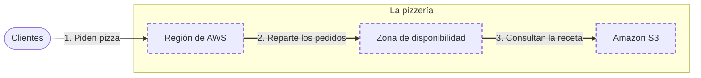

<!-- Archivo generado por pnpm content:gen a partir de scenario.yaml. No se edita a mano. -->

# Una pizzería que abre en otra ciudad

> ⚠️ **Spoilers:** esta ficha contiene las respuestas del escenario. Si lo querés jugar, no sigas leyendo.

Una pizzería elige dónde abrir, cómo no quedarse sin cocina y dónde guardar sus recetas.

| Campo | Valor |
|---|---|
| Id | `pizzeria` |
| Versión | 1 |
| Estado | published |
| Nivel | 0 |
| Áreas | `fundamentos` |
| Duración estimada | 5 min |
| Autores | @blueprint-e2e |
| Paleta | auto · extra: Pago por uso |

## Contexto

Una pizzería de barrio quiere abrir en otra ciudad.
Necesita estar cerca de sus clientes, seguir cocinando si una cocina falla y no perder sus recetas.

## Objetivos

| Id | Tipo | Categoría | Objetivo |
|---|---|---|---|
| `near-customers` | Meta | latency | Estar cerca de los clientes. |
| `keep-cooking` | Restricción | availability | Seguir cocinando aunque una cocina se quede sin luz. |
| `keep-recipes` | Meta | durability | No perder nunca las recetas. |

## Diagrama con las respuestas óptimas

Los casilleros tienen borde punteado.

## Respuestas

### Casillero `city`

> La ciudad donde la pizzería abre, elegida por estar cerca de sus clientes.

| Servicio | Grado | Objetivos | Justificación | Referencias |
|---|---|---|---|---|
| Región de AWS (`region`) | 🟢 Óptimo | `near-customers` | Como la ciudad que elige la pizzería, una región es el lugar del mundo donde corren tus recursos: elegir una cercana acorta la distancia hasta los clientes. | [1](https://docs.aws.amazon.com/whitepapers/latest/aws-overview/global-infrastructure.html) |
| Ubicación de borde (`edge-location`) | 🔴 Incorrecto | — | Acerca la entrega de contenido, pero no es donde se instala la pizzería. |  |

### Casillero `kitchens`

> Dos cocinas en edificios distintos de la misma ciudad, con luz propia cada una.

| Servicio | Grado | Objetivos | Justificación | Referencias |
|---|---|---|---|---|
| Zona de disponibilidad (`availability-zone`) | 🟢 Óptimo | `keep-cooking` | Como dos cocinas con luz propia, las zonas de disponibilidad están aisladas: si una falla, la otra sigue funcionando. | [1](https://docs.aws.amazon.com/AWSEC2/latest/UserGuide/using-regions-availability-zones.html) |
| Amazon EC2 (`ec2`) | 🔴 Incorrecto | viola `keep-cooking` | Una sola computadora alquilada se apaga si se corta su luz: no aporta una cocina aparte. |  |

### Casillero `recipes`

> El lugar donde se guardan las recetas y las fotos del menú.

| Servicio | Grado | Objetivos | Justificación | Referencias |
|---|---|---|---|---|
| Amazon S3 (`s3`) | 🟢 Óptimo | `keep-recipes` | Como un archivo que nunca se pierde, guarda las recetas y las fotos con alta durabilidad y se paga por lo guardado. | [1](https://docs.aws.amazon.com/AmazonS3/latest/userguide/Welcome.html) |
| Amazon EFS (`efs`) | 🔴 Incorrecto | — | Es un disco que se comparte entre computadoras: no hace falta montarlo para guardar recetas. |  |
