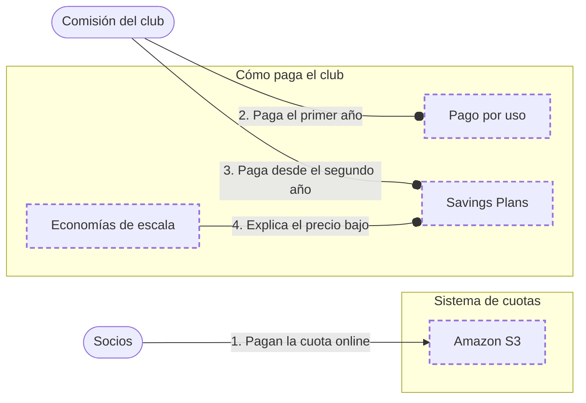

<!-- Archivo generado por pnpm content:gen a partir de scenario.yaml. No se edita a mano. -->

# Un club de barrio que cobra las cuotas online

> ⚠️ **Spoilers:** esta ficha contiene las respuestas del escenario. Si lo querés jugar, no sigas leyendo.

Un club de barrio cobra las cuotas online: el primer año no sabe cuánto lo van a usar y después el uso es parejo todo el año.

| Campo | Valor |
|---|---|
| Id | `club-cuotas-online` |
| Versión | 1 |
| Estado | beta |
| Nivel | 0 |
| Áreas | `fundamentos`, `storage` |
| Duración estimada | 4 min |
| Autores | @elissamburu |
| Paleta | auto |

## Contexto

Un club de barrio va a cobrar las cuotas online y guardar los comprobantes. El primer año no
sabe cuántos socios lo van a usar. Después, el uso va a ser parejo todo el año.

## Objetivos

| Id | Tipo | Categoría | Objetivo |
|---|---|---|---|
| `no-fixed-commitment` | Restricción | cost | El primer año no se compromete a ningún gasto fijo: todavía no sabe cuánto va a usar. |
| `steady-savings` | Meta | cost | Cuando el uso ya es estable, pagar menos. |
| `cheaper-than-own-server` | Meta | cost | Gastar menos que lo que le costaría comprar y mantener su propio servidor. |

## Diagrama con las respuestas óptimas

Los casilleros tienen borde punteado.

## Respuestas

### Casillero `first-year`

> Cómo se paga el primer año, mientras no se sabe cuántos socios van a usar el sistema.

| Servicio | Grado | Objetivos | Justificación | Referencias |
|---|---|---|---|---|
| Pago por uso (`pay-as-you-go`) | 🟢 Óptimo | `no-fixed-commitment` | Se paga solo por lo que se usa, mientras se usa y sin contratos de largo plazo: si el primer año hay pocos socios, la cuenta es chica. | [1](https://docs.aws.amazon.com/whitepapers/latest/how-aws-pricing-works/key-principles.html) |
| Savings Plans (`savings-plans`) | 🔴 Incorrecto | viola `no-fixed-commitment` | Es un compromiso de 1 o 3 años: justo lo que el club no quiere el primer año. |  |

### Casillero `later-years`

> Cómo se paga desde el segundo año, cuando el uso ya es parejo.

| Servicio | Grado | Objetivos | Justificación | Referencias |
|---|---|---|---|---|
| Savings Plans (`savings-plans`) | 🟢 Óptimo | `steady-savings` | Con el uso ya parejo, el club puede comprometerse a un gasto por hora durante 1 o 3 años a cambio de precios más bajos en el cómputo que usa el sistema. | [1](https://docs.aws.amazon.com/savingsplans/latest/userguide/what-is-savings-plans.html) |
| Pago por uso (`pay-as-you-go`) | 🟠 Aceptable | `steady-savings` | Sigue funcionando, pero con el uso ya estable paga más que con un compromiso. | [1](https://docs.aws.amazon.com/whitepapers/latest/how-aws-pricing-works/key-principles.html) |

### Casillero `why-cheaper`

> Por qué al club le sale más barato que tener su propio servidor: el proveedor atiende a muchísimos clientes a la vez.

| Servicio | Grado | Objetivos | Justificación | Referencias |
|---|---|---|---|---|
| Economías de escala (`economies-of-scale`) | 🟢 Óptimo | `cheaper-than-own-server` | AWS junta el uso de cientos de miles de clientes, y eso le permite costos variables más bajos que los que el club lograría comprando y manteniendo su propio servidor. | [1](https://docs.aws.amazon.com/whitepapers/latest/aws-overview/six-advantages-of-cloud-computing.html) |
| Elasticidad (`elasticity`) | 🔴 Incorrecto | — | Explica cómo se adapta la capacidad, no por qué el precio es bajo. |  |

### Casillero `receipts`

> Donde quedan guardados los comprobantes de pago de cada socio.

| Servicio | Grado | Objetivos | Justificación | Referencias |
|---|---|---|---|---|
| Amazon S3 (`s3`) | 🟢 Óptimo | `no-fixed-commitment` | Guarda cada comprobante como un objeto y cobra por lo que queda guardado, sin comprometerse a un gasto fijo: si el primer año hay pocos socios, se guarda poco y se paga poco. | [1](https://docs.aws.amazon.com/s3/) |
| Amazon EFS (`efs`) | 🔴 Incorrecto | — | Es un disco compartido para computadoras, no un depósito de comprobantes. |  |
