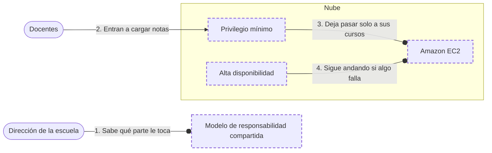

<!-- Archivo generado por pnpm content:gen a partir de scenario.yaml. No se edita a mano. -->

# Una escuela que pasa sus notas a la nube

> ⚠️ **Spoilers:** esta ficha contiene las respuestas del escenario. Si lo querés jugar, no sigas leyendo.

Una escuela lleva su sistema de notas a la nube: cada docente ve solo sus cursos y en la semana de cierre el sistema no se puede caer.

| Campo | Valor |
|---|---|
| Id | `escuela-notas` |
| Versión | 1 |
| Estado | beta |
| Nivel | 0 |
| Áreas | `fundamentos`, `security` |
| Duración estimada | 4 min |
| Autores | @elissamburu |
| Paleta | auto |

## Contexto

Una escuela secundaria va a llevar su sistema de notas a un equipo en la nube. Cada docente
tiene que ver solo sus cursos, y en la semana de cierre de notas el sistema no se puede caer.

## Objetivos

| Id | Tipo | Categoría | Objetivo |
|---|---|---|---|
| `own-courses-only` | Restricción | security | Cada docente ve y carga solo las notas de sus cursos. |
| `security-split` | Restricción | security | La escuela sabe qué parte de la seguridad le toca a ella y cuál al proveedor. |
| `survives-failure` | Meta | availability | Si falla una computadora en la semana de cierre, el sistema sigue andando. |
| `no-own-hardware` | Meta | cost | El sistema de notas corre en la nube sin que la escuela compre equipos propios. |

## Diagrama con las respuestas óptimas

Los casilleros tienen borde punteado.

## Respuestas

### Casillero `responsibility`

> Quién se ocupa de qué en la seguridad: una parte la escuela, otra el proveedor.

| Servicio | Grado | Objetivos | Justificación | Referencias |
|---|---|---|---|---|
| Modelo de responsabilidad compartida (`shared-responsibility`) | 🟢 Óptimo | `security-split` | AWS se ocupa de la seguridad *de* la nube (equipos, edificios y red) y la escuela, de la seguridad *en* la nube: sus datos, sus usuarios y cómo configura lo que usa. | [1](https://aws.amazon.com/compliance/shared-responsibility-model/) |
| Privilegio mínimo (`least-privilege`) | 🔴 Incorrecto | viola `security-split` | Ordena los permisos, pero no dice qué parte de la seguridad le toca a cada uno. |  |

### Casillero `permissions`

> Que cada docente solo pueda tocar las notas de sus cursos, nada más.

| Servicio | Grado | Objetivos | Justificación | Referencias |
|---|---|---|---|---|
| Privilegio mínimo (`least-privilege`) | 🟢 Óptimo | `own-courses-only` | Cada docente recibe solo los permisos que necesita para su tarea: ver y cargar las notas de sus cursos, y nada más. | [1](https://docs.aws.amazon.com/IAM/latest/UserGuide/best-practices.html) |
| Modelo de responsabilidad compartida (`shared-responsibility`) | 🔴 Incorrecto | viola `own-courses-only` | Reparte la seguridad entre la escuela y el proveedor, pero no limita lo que puede hacer cada docente. |  |

### Casillero `server`

> El equipo en la nube donde corre el sistema de notas.

| Servicio | Grado | Objetivos | Justificación | Referencias |
|---|---|---|---|---|
| Amazon EC2 (`ec2`) | 🟢 Óptimo | `no-own-hardware` | Es un servidor virtual donde la escuela instala y corre su sistema de notas, sin comprar equipos propios. El sistema operativo, sus parches y lo que se instala quedan a cargo de la escuela. | [1](https://docs.aws.amazon.com/ec2/) |
| Amazon S3 (`s3`) | 🔴 Incorrecto | — | Guarda archivos, pero no corre el sistema. |  |

### Casillero `availability`

> Que el sistema siga andando aunque una computadora falle en plena semana de cierre.

| Servicio | Grado | Objetivos | Justificación | Referencias |
|---|---|---|---|---|
| Alta disponibilidad (`high-availability`) | 🟢 Óptimo | `survives-failure` | Con recursos repetidos, si falla una computadora otra sigue atendiendo y el sistema no se cae en la semana de cierre. | [1](https://docs.aws.amazon.com/wellarchitected/latest/reliability-pillar/availability.html) |
| Elasticidad (`elasticity`) | 🔴 Incorrecto | — | Suma capacidad cuando hay más gente, no reemplaza lo que falla. |  |
