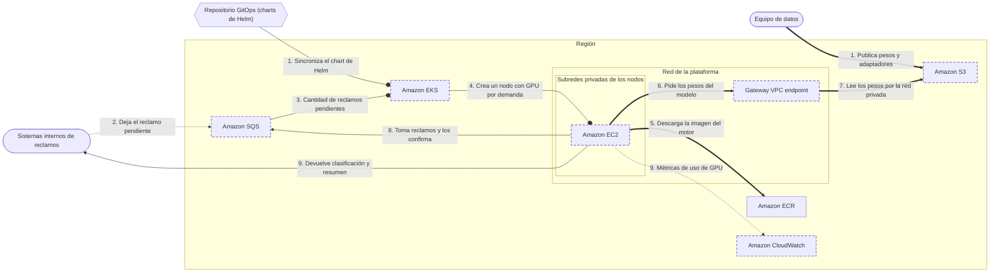

<!-- Archivo generado por pnpm content:gen a partir de scenario.yaml. No se edita a mano. -->

# Un modelo propio con GPU en la plataforma Kubernetes de la empresa

> ⚠️ **Spoilers:** esta ficha contiene las respuestas del escenario. Si lo querés jugar, no sigas leyendo.

Una logística sirve su modelo de lenguaje ajustado en el clúster que ya usan todos los equipos: GPUs que se apagan de noche, pesos de decenas de GB que cargan rápido y métricas para dimensionar.

| Campo | Valor |
|---|---|
| Id | `gpu-inference-on-eks` |
| Versión | 1 |
| Estado | draft |
| Nivel | 400 |
| Áreas | `ml`, `containers` |
| Duración estimada | 15 min |
| Autores | @elissamburu |
| Paleta | auto |

## Contexto

Una **empresa de logística** tiene una **plataforma interna sobre Kubernetes**: todos los
equipos despliegan con **charts de Helm** y un flujo **GitOps**, y el equipo de plataforma
opera el clúster. Los nodos corren en **subredes privadas** y las imágenes se guardan en
**ECR**.

El equipo de datos ajustó un **modelo de lenguaje open-weights** para **clasificar y resumir
reclamos**. Le cambió la arquitectura (agregó una cabeza de clasificación propia) y entrenó
**adaptadores** por tipo de reclamo que el motor carga **en caliente**, sin reiniciar. Lo
sirve con un **motor de inferencia de código abierto** en un contenedor.

Los sistemas internos de reclamos **no necesitan la respuesta en el momento**: dejan cada
reclamo **en espera de procesamiento**, los pods de inferencia lo toman cuando pueden y
devuelven la clasificación y el resumen a la API interna del sistema de reclamos. La
cantidad de réplicas sigue a la **cantidad de reclamos pendientes**.

La demanda sigue el día: **picos a la mañana**, cuando entran los reclamos de la noche, y
**casi nada de noche**. Procesar un reclamo lleva desde un segundo (clasificar) hasta
varios minutos (resumir un expediente largo).

Los **pesos del modelo pesan decenas de GB**: en el pico, varios nodos nuevos los descargan
a la vez, y cada minuto que tardan es un minuto de GPU pagada sin responder.

## Objetivos

| Id | Tipo | Categoría | Objetivo |
|---|---|---|---|
| `same-platform` | Restricción | team | La inferencia corre en la plataforma Kubernetes existente y se despliega con las mismas herramientas que el resto de los equipos: charts de Helm y GitOps. |
| `own-model` | Restricción | operations | Se sirve el modelo propio, con su arquitectura y sus adaptadores cargados en caliente, sin convertirlo a otro formato. |
| `gpu` | Restricción | performance | Los pods de inferencia corren sobre GPU. |
| `no-idle-capacity` | Meta | cost | No pagar capacidad ociosa de noche: ni GPUs ni almacenamiento aprovisionado que nadie usa. |
| `fast-node-ready` | Meta | scalability | Que un nodo nuevo sirva pedidos lo antes posible en el pico de la mañana, aunque los pesos pesen decenas de GB. |
| `gpu-metrics` | Meta | operations | Tener métricas de uso y de memoria de GPU por nodo y por pod para dimensionar instancias y réplicas. |
| `absorb-peaks` | Meta | availability | En el pico de la mañana ningún reclamo se pierde ni se rechaza mientras arrancan los nodos, y la capacidad crece con los reclamos pendientes. |
| `model-updates` | Meta | operations | El equipo de datos publica pesos y adaptadores nuevos sin reconstruir la imagen del motor. |

## Diagrama con las respuestas óptimas

Los casilleros tienen borde punteado.

## Respuestas

### Casillero `platform`

> Plataforma que orquesta los contenedores del motor de inferencia, igual que los del resto de los equipos.

| Servicio | Grado | Objetivos | Justificación | Referencias |
|---|---|---|---|---|
| Amazon EKS (`eks`) | 🟢 Óptimo | `same-platform`, `own-model`, `gpu` | Es el clúster que ya opera la plataforma: el motor se despliega con un chart de Helm y lo sincroniza GitOps, como cualquier otro servicio. Como el motor de código abierto corre en un contenedor propio, sirve el modelo con su arquitectura y carga los adaptadores sin convertir nada. Los pods piden GPU (`nvidia.com/gpu`) y el clúster les consigue nodos que la tengan. | [1](https://docs.aws.amazon.com/eks/latest/userguide/ml-inference.html) [2](https://docs.aws.amazon.com/eks/latest/userguide/auto-accelerated.html) |
| Amazon Bedrock (`bedrock`) | 🔴 Incorrecto | viola `own-model`, `same-platform` | Su importación de modelos propios solo acepta ciertas arquitecturas (Llama, Mistral, Mixtral, Flan, GPTBigCode, Qwen y GPT-OSS), con los pesos en formato de Hugging Face: un modelo con arquitectura propia no entra sin rehacerlo. Además, la inferencia quedaría fuera del clúster y de su flujo de despliegue. |  |
| Amazon SageMaker AI (`sagemaker-ai`) | 🔴 Incorrecto | viola `same-platform` | Es una muy buena opción para servir contenedores propios con GPU y escalar endpoints, pero es otra plataforma, con otros despliegues y otra operación, fuera del clúster, de Helm y de GitOps. El caso exige usar la plataforma que el equipo ya opera. |  |
| Amazon ECS (`ecs`) | 🔴 Incorrecto | viola `same-platform` | Soporta tareas con GPU, pero es el orquestador propio de AWS, no Kubernetes: los charts de Helm y el flujo GitOps de la plataforma no sirven ahí. |  |

Pistas:

1. La restricción no es técnica sino de plataforma: tiene que ser el mismo lugar donde despliegan todos.
2. Un servicio administrado de modelos te obliga a encajar en sus arquitecturas; un contenedor propio, no.

### Casillero `gpu-compute`

> Máquinas con GPU donde corren los pods de inferencia, que aparecen con la demanda y desaparecen cuando quedan vacías.

| Servicio | Grado | Objetivos | Justificación | Referencias |
|---|---|---|---|---|
| Amazon EC2 (`ec2`) | 🟢 Óptimo | `gpu`, `no-idle-capacity` | Instancias con GPU (familias G y P) como nodos. Con Auto Mode o Karpenter se crean cuando hay pods de GPU pendientes y se eliminan cuando quedan vacías: de noche queda casi nada. Auto Mode trae los drivers de NVIDIA y el plugin de dispositivos; con nodos propios, la AMI acelerada trae el driver y el toolkit, y el plugin se instala aparte. | [1](https://docs.aws.amazon.com/eks/latest/userguide/auto-accelerated.html) [2](https://docs.aws.amazon.com/eks/latest/userguide/ml-eks-optimized-ami.html) |
| AWS Fargate (`fargate`) | 🔴 Incorrecto | viola `gpu` | Las consideraciones de uso con Kubernetes lo dicen explícitamente: las GPU no están disponibles en esta capacidad serverless. Tampoco corre DaemonSets, que usan los agentes de GPU y de métricas. |  |
| AWS Lambda (`lambda`) | 🔴 Incorrecto | viola `same-platform` | No es un nodo del clúster: no puede alojar los pods de inferencia. Y sus cuotas documentadas no alcanzan para este modelo: hasta 10.240 MB de memoria por función y 15 minutos por invocación (90 en algunos casos con Managed Instances), con pesos de decenas de GB y resúmenes que tardan minutos. |  |

Pistas:

1. La capacidad serverless de contenedores no tiene lo que este modelo necesita.
2. Pensá en máquinas virtuales con aceleradores que el clúster crea y destruye solo.

### Casillero `weights-store`

> Dónde quedan los pesos y los adaptadores que publica el equipo de datos y que cada réplica nueva lee al arrancar.

| Servicio | Grado | Objetivos | Justificación | Referencias |
|---|---|---|---|---|
| Amazon S3 (`s3`) | 🟢 Óptimo | `fast-node-ready`, `no-idle-capacity`, `model-updates` | Los pesos quedan en un bucket y cada réplica nueva los lee en paralelo. La guía de inferencia de AWS usa Run:ai Model Streamer, una herramienta de código abierto de NVIDIA que el motor usa para llevarlos directo a la memoria de la GPU; el driver CSI de Mountpoint es otra opción. Se paga lo guardado y los pedidos: de noche no queda capacidad aprovisionada ociosa. | [1](https://docs.aws.amazon.com/eks/latest/userguide/ml-inference.html) [2](https://docs.aws.amazon.com/eks/latest/userguide/ml-inference-fast-model-loading.html) [3](https://docs.aws.amazon.com/eks/latest/userguide/s3-csi.html) |
| Amazon FSx (`fsx`) | 🟠 Aceptable | `no-idle-capacity` | Funciona y es rápido: vinculado al bucket y precalentado, sirve los pesos a muchos nodos a la vez, y la guía de almacenamiento para IA lo recomienda con varias instancias con GPU. Pero se aprovisiona por capacidad, con throughput proporcional a ella, y se paga también de noche, cuando no hay GPUs. | [1](https://docs.aws.amazon.com/eks/latest/best-practices/aiml-storage.html) [2](https://docs.aws.amazon.com/fsx/latest/LustreGuide/ssd-storage.html) |
| Amazon EFS (`efs`) | 🟠 Aceptable | `fast-node-ready` | Un sistema de archivos compartido y elástico que no se aprovisiona: se paga lo guardado y lo leído. La guía lo propone para caches de modelos con necesidades de rendimiento moderadas; cada cliente llega a 1.500 MiBps como máximo, así que decenas de GB por nodo tardan más que leerlos en paralelo. | [1](https://docs.aws.amazon.com/eks/latest/best-practices/aiml-storage.html) [2](https://docs.aws.amazon.com/efs/latest/ug/performance.html) |
| Amazon ECR (`ecr`) | 🟠 Aceptable | `fast-node-ready`, `model-updates` | Funciona: los pesos viajan dentro de la imagen del motor. Pero cada nodo nuevo baja una imagen de decenas de GB antes de arrancar, y cada modelo o adaptador nuevo obliga a reconstruir la imagen y redesplegar. La guía de almacenamiento para IA recomienda no embeber los pesos en la imagen porque agranda la imagen y el tiempo de descarga. | [1](https://docs.aws.amazon.com/eks/latest/best-practices/aiml-storage.html) |
| Amazon EBS (`ebs`) | 🔴 Incorrecto | — | Un volumen de bloques se conecta, en general, a un solo nodo y vive en una zona: cada nodo nuevo necesitaría su propia copia de los pesos, y alguien tendría que cargarla antes de que el nodo arranque. |  |

Pistas:

1. Nada de lo que elijas debería cobrarse de noche si no hay nodos.
2. La guía de inferencia de AWS lee los pesos en paralelo, directo a la memoria de la GPU, desde el almacén más barato.

### Casillero `weights-private-path`

> Camino privado de los nodos hacia los pesos, que no se sature cuando varios nodos nuevos los descargan a la vez.

| Servicio | Grado | Objetivos | Justificación | Referencias |
|---|---|---|---|---|
| Gateway VPC endpoint (`vpc-gateway-endpoint`) | 🟢 Óptimo | `fast-node-ready`, `no-idle-capacity` | Una ruta en las tablas de las subredes hacia el almacén de los pesos, sin cargo por hora ni por GB. La guía de carga rápida de modelos lo recomienda: el tráfico no pasa por la salida compartida a internet, que en el pico se vuelve el cuello de botella cuando varios nodos bajan el modelo completo a la vez. | [1](https://docs.aws.amazon.com/eks/latest/userguide/ml-inference-fast-model-loading.html) [2](https://docs.aws.amazon.com/vpc/latest/privatelink/gateway-endpoints.html) |
| NAT gateway (`nat-gateway`) | 🟠 Aceptable | `fast-node-ready` | Funciona, pero su ancho de banda (hasta 100 Gbps) se comparte entre todos los nodos de la subred: en el pico, varios nodos bajando decenas de GB compiten entre sí y todos tardan más en servir. Además cobra por cada GB que procesa. | [1](https://docs.aws.amazon.com/eks/latest/userguide/ml-inference-fast-model-loading.html) |
| Interface VPC endpoint (AWS PrivateLink) (`vpc-interface-endpoint`) | 🟠 Aceptable | `no-idle-capacity` | Llega por la red privada sin compartir la salida a internet, pero cobra por hora en cada zona aunque de noche no pase nada, y además por GB. La ruta privada sin cargo hace lo mismo para este servicio. | [1](https://docs.aws.amazon.com/vpc/latest/privatelink/gateway-endpoints.html) |
| Internet gateway (`internet-gateway`) | 🔴 Incorrecto | — | Los nodos están en subredes privadas: para usarlo tendrían que pasar a subredes públicas con IP pública, y el tráfico iría a los puntos de acceso públicos del servicio. |  |

Pistas:

1. Pensá qué pasa a las 8 de la mañana, cuando diez nodos bajan el modelo completo al mismo tiempo.
2. Para este almacén existe un acceso privado que es solo una ruta y no tiene cargo.

### Casillero `gpu-metrics`

> Métricas de uso, memoria y potencia de cada GPU, por nodo y por pod, para dimensionar instancias y réplicas.

| Servicio | Grado | Objetivos | Justificación | Referencias |
|---|---|---|---|---|
| Amazon CloudWatch (`cloudwatch`) | 🟢 Óptimo | `gpu-metrics` | Container Insights con observabilidad mejorada recolecta métricas de GPU de NVIDIA por nodo, pod y contenedor (uso, memoria, tensor cores, potencia) desde la versión v1.3.0 del add-on de observabilidad. Necesita el plugin de dispositivos de NVIDIA en el clúster y el toolkit de contenedores en los nodos, que ya trae la AMI acelerada. Con el monitoreo detallado, recolecta cada segundo para no perder picos cortos. | [1](https://docs.aws.amazon.com/AmazonCloudWatch/latest/monitoring/Container-Insights-metrics-enhanced-EKS.html) |
| AWS X-Ray (`x-ray`) | 🔴 Incorrecto | — | Traza pedidos a través de los componentes de una aplicación para ver latencias y errores; no mide cuánto se usa cada GPU ni su memoria. |  |
| AWS CloudTrail (`cloudtrail`) | 🔴 Incorrecto | — | Registra las llamadas a las APIs de AWS de la cuenta, por ejemplo quién creó un nodo o cambió un permiso; no mide el uso de las GPU. |  |

Pistas:

1. Buscá el servicio de métricas y logs que ya tiene una vista específica para contenedores.

### Casillero `claims-queue`

> Donde esperan los reclamos hasta que una réplica los toma; su cantidad de pendientes decide cuántas réplicas corren.

| Servicio | Grado | Objetivos | Justificación | Referencias |
|---|---|---|---|---|
| Amazon SQS (`sqs`) | 🟢 Óptimo | `absorb-peaks`, `no-idle-capacity` | Cada reclamo espera en la cola (4 días por defecto, hasta 14) y los pods lo toman a su ritmo: en el pico nada se pierde mientras arrancan los nodos. KEDA, un proyecto graduado de la CNCF (no de AWS), escala las réplicas según los mensajes pendientes y las baja a cero sin mensajes; los nodos vacíos se eliminan. El visibility timeout (hasta 12 h) tiene que cubrir el resumen más largo. | [1](https://docs.aws.amazon.com/AWSSimpleQueueService/latest/SQSDeveloperGuide/sqs-visibility-timeout.html) [2](https://docs.aws.amazon.com/AWSSimpleQueueService/latest/SQSDeveloperGuide/quotas-messages.html) [3](https://keda.sh/docs/2.17/scalers/aws-sqs/) |
| Amazon Kinesis Data Streams (`kinesis-data-streams`) | 🟠 Aceptable | `absorb-peaks`, `no-idle-capacity` | Retiene los registros, así que el pico no se pierde. Pero no es una cola de trabajo: cada shard se lee en orden (un resumen largo frena a los que vienen detrás) y no hay confirmación por mensaje. El escalador de KEDA para este servicio dimensiona por cantidad de shards, no por trabajo pendiente: las réplicas no crecen con el pico ni bajan a cero de noche. | [1](https://docs.aws.amazon.com/streams/latest/dev/how-do-i-size-a-stream.html) [2](https://keda.sh/docs/2.17/scalers/aws-kinesis/) |
| Amazon SNS (`sns`) | 🔴 Incorrecto | viola `absorb-peaks` | Es pub/sub: empuja cada mensaje a sus suscriptores en el momento y no lo guarda para que los pods lo tomen a su ritmo. Con los nodos todavía arrancando, no hay quién lo reciba. Para trabajo pendiente se lo pone delante de una cola, no en su lugar. |  |
| Amazon EventBridge (`eventbridge`) | 🔴 Incorrecto | — | Enruta eventos a destinos según reglas; no es una cola de trabajo de la que los pods tomen reclamos cuando pueden, ni expone cuántos quedan pendientes para escalar. |  |

Pistas:

1. Nadie espera la respuesta en el momento: el trabajo puede esperar a que haya una réplica libre.
2. Buscá algo de lo que los pods tomen mensajes cuando pueden, y que diga cuántos quedan pendientes.

## Referencias

- [Inferencia de IA y ML en EKS](https://docs.aws.amazon.com/eks/latest/userguide/ml-inference.html)
- [Acelerar la carga de modelos en EKS](https://docs.aws.amazon.com/eks/latest/userguide/ml-inference-fast-model-loading.html)
- [Mejores prácticas de EKS para IA y ML: almacenamiento](https://docs.aws.amazon.com/eks/latest/best-practices/aiml-storage.html)
