<!-- Archivo generado por pnpm content:gen a partir de scenario.yaml. No se edita a mano. -->

# Asistente de pólizas para los clientes de una aseguradora

> ⚠️ **Spoilers:** esta ficha contiene las respuestas del escenario. Si lo querés jugar, no sigas leyendo.

Los clientes registrados preguntan en lenguaje natural por coberturas, carencias y exclusiones, y el asistente responde citando las condiciones generales.

| Campo | Valor |
|---|---|
| Id | `insurance-docs-assistant` |
| Versión | 1 |
| Estado | beta |
| Nivel | 200 |
| Áreas | `ml`, `serverless` |
| Duración estimada | 8 min |
| Autores | @elissamburu |
| Paleta | auto |

## Contexto

Una **aseguradora** quiere sumar a su web un **asistente** donde los **clientes registrados**
pregunten en lenguaje natural por las condiciones de sus productos: qué cubre una póliza,
cuánto dura la carencia, qué exclusiones tiene.

La fuente de verdad son unos **2.000 PDF de condiciones generales**. El área legal los
actualiza **cada semana**: agrega productos, corrige cláusulas y da de baja versiones viejas.

Legal es clara: el asistente **no puede inventar** ni opinar. Tiene que responder solo con
lo que dicen esos documentos y **mostrar de qué documento sale** cada respuesta, para que el
cliente pueda leer la cláusula completa.

El equipo es chico: programa bien, pero **no tiene científicos de datos** y **no quiere
administrar servidores**. Las consultas vienen por rachas: muchas cuando se renuevan las
pólizas y casi ninguna de noche.

## Objetivos

| Id | Tipo | Categoría | Objetivo |
|---|---|---|---|
| `grounded-answers` | Restricción | compliance | Las respuestas se basan solo en los documentos de la aseguradora y muestran de qué documento sale cada una. |
| `registered-only` | Restricción | security | Solo los clientes registrados pueden usar el asistente. |
| `no-own-models` | Restricción | team | Sin entrenar, ajustar ni hospedar modelos propios: el equipo no tiene científicos de datos. |
| `auto-refresh` | Meta | operations | Los documentos nuevos o modificados se incorporan sin intervención manual ni reentrenamiento. |
| `no-servers` | Meta | operations | Sin servidores ni sistemas operativos que administrar. |
| `pay-per-use` | Meta | cost | Pagar por uso: sin capacidad encendida cuando nadie consulta. |

## Diagrama con las respuestas óptimas

Los casilleros tienen borde punteado.

```mermaid
flowchart LR
  n_legal(["Área legal"])
  n_customer(["Cliente registrado"])
  subgraph g_cloud["Nube"]
    n_docs_store["Amazon S3"]
    n_rag["Amazon Bedrock"]
    n_api_entry["Amazon API Gateway"]
    n_assistant_logic["AWS Lambda"]
    n_customer_auth["Amazon Cognito"]
  end
  n_legal ==>|"1. Publica condiciones nuevas"| n_docs_store
  n_docs_store -.->|"2. Sincronización programada"| n_rag
  n_customer -->|"3. Inicia sesión"| n_customer_auth
  n_customer_auth -->|"4. Devuelve un token"| n_customer
  n_customer -->|"5. Pregunta con el token"| n_api_entry
  n_api_entry --o|"6. Valida el token"| n_customer_auth
  n_api_entry -->|"7. Reenvía la pregunta"| n_assistant_logic
  n_assistant_logic -->|"8. Consulta los documentos"| n_rag
  n_rag -->|"9. Respuesta con citas"| n_assistant_logic
  n_assistant_logic -->|"10. Respuesta y documentos fuente"| n_api_entry
  n_api_entry -->|"11. Muestra la respuesta citada"| n_customer
  classDef slot stroke-dasharray: 6 4,stroke-width:2px
  class n_docs_store,n_rag,n_api_entry,n_assistant_logic,n_customer_auth slot
```

## Respuestas

### Casillero `docs-store`

> Repositorio durable donde legal publica los PDF de condiciones generales y desde donde se sincronizan con el asistente.

| Servicio | Grado | Objetivos | Justificación | Referencias |
|---|---|---|---|---|
| Amazon S3 (`s3`) | 🟢 Óptimo | `auto-refresh`, `no-servers`, `pay-per-use` | Almacenamiento de objetos durable, pago por lo guardado y sin servidores. Es uno de los conectores nativos de la base de conocimiento administrada, que sincroniza el bucket con una frecuencia programada: los PDF que legal agrega, cambia o borra se incorporan solos, de forma incremental. | [1](https://docs.aws.amazon.com/bedrock/latest/userguide/kb-managed-create.html) [2](https://docs.aws.amazon.com/bedrock/latest/userguide/kb-managed-sync.html) |
| Amazon EFS (`efs`) | 🔴 Incorrecto | viola `auto-refresh` | Es un sistema de archivos que se monta desde cómputo. No es un conector de la base de conocimiento: habría que copiar los PDF a mano o con código propio para que se incorporen. |  |
| Amazon EBS (`ebs`) | 🔴 Incorrecto | viola `no-servers`, `auto-refresh` | Es un disco en bloque conectado a una instancia: requiere un servidor y la base de conocimiento no lo puede leer como fuente de documentos. |  |

Pistas:

1. Buscá almacenamiento de objetos, no de archivos ni de bloques.
2. Tiene que ser una fuente que el servicio del asistente sepa leer y sincronizar solo.

### Casillero `rag`

> Servicio administrado que indexa los documentos, recupera los fragmentos relevantes y genera la respuesta con un modelo, citando la fuente.

| Servicio | Grado | Objetivos | Justificación | Referencias |
|---|---|---|---|---|
| Amazon Bedrock (`bedrock`) | 🟢 Óptimo | `grounded-answers`, `no-own-models`, `auto-refresh`, `no-servers` | Una base de conocimiento administrada se encarga de la ingesta, los embeddings, el almacenamiento y la recuperación, y sincroniza la fuente con un cronograma diario o semanal. La consulta genera la respuesta a partir de lo recuperado, con citas que apuntan a cada fragmento; la recuperación devuelve la ubicación del documento de origen. Usa modelos fundacionales administrados: nada que entrenar ni hospedar. | [1](https://docs.aws.amazon.com/bedrock/latest/userguide/kb-build-managed.html) [2](https://docs.aws.amazon.com/bedrock/latest/userguide/kb-managed-sync.html) [3](https://docs.aws.amazon.com/bedrock/latest/userguide/kb-test-agentic-retrieve.html) [4](https://docs.aws.amazon.com/bedrock/latest/userguide/kb-test-retrieve.html) |
| Amazon SageMaker AI (`sagemaker-ai`) | 🔴 Incorrecto | viola `no-own-models` | Sirve para entrenar, ajustar y desplegar modelos en endpoints propios: justo lo que el equipo no puede hacer. Además, la indexación y la recuperación de los documentos quedarían a cargo del equipo. |  |
| Amazon Comprehend (`comprehend`) | 🔴 Incorrecto | — | Analiza texto (entidades, frases clave, sentimiento, clasificación), pero no genera respuestas a preguntas ni recupera fragmentos de una colección de documentos. |  |
| Amazon Textract (`textract`) | 🔴 Incorrecto | — | Extrae texto, formularios y tablas de documentos. Podría ser un paso previo de lectura, pero no busca en la colección ni redacta respuestas. |  |

Pistas:

1. Necesitás modelos generativos ya entrenados, consumidos como servicio.
2. Buscá una opción que además indexe tus documentos y responda citándolos.

### Casillero `api-entry`

> Punto de entrada HTTPS que recibe las preguntas del navegador, valida el token del cliente y las pasa a la lógica.

| Servicio | Grado | Objetivos | Justificación | Referencias |
|---|---|---|---|---|
| Amazon API Gateway (`apigateway`) | 🟢 Óptimo | `registered-only`, `no-servers`, `pay-per-use` | Un API administrado cobra por pedido y valida el token del cliente con un autorizador JWT antes de invocar la lógica: un pedido sin token válido se rechaza sin llegar al backend. | [1](https://docs.aws.amazon.com/apigateway/latest/developerguide/http-api-jwt-authorizer.html) |
| Application Load Balancer (`alb`) | 🟠 Aceptable | `pay-per-use` | Un balanceador de aplicaciones puede invocar funciones como destino y no requiere servidores, pero cobra por hora aunque nadie consulte: de noche pagás capacidad ociosa. | [1](https://docs.aws.amazon.com/elasticloadbalancing/latest/application/lambda-functions.html) |
| Network Load Balancer (`nlb`) | 🔴 Incorrecto | — | Balancea conexiones TCP y UDP en capa 4: no entiende pedidos HTTP ni valida el token del cliente. |  |
| Amazon Route 53 (`route53`) | 🔴 Incorrecto | — | Resuelve nombres DNS hacia un destino; no recibe ni procesa pedidos HTTP. |  |

Pistas:

1. Pensá en un servicio que cobre por pedido y no por hora.
2. Tiene que rechazar a quien no traiga un token válido antes de ejecutar la lógica.

### Casillero `assistant-logic`

> Lógica breve que recibe la pregunta autenticada, consulta la base de conocimiento y devuelve la respuesta con sus fuentes.

| Servicio | Grado | Objetivos | Justificación | Referencias |
|---|---|---|---|---|
| AWS Lambda (`lambda`) | 🟢 Óptimo | `no-servers`, `pay-per-use` | Cómputo por evento: corre solo cuando llega una pregunta, escala solo en las rachas de renovaciones y no cobra de noche. Recibe del API los datos del token validado y llama a la base de conocimiento con el SDK. | [1](https://docs.aws.amazon.com/lambda/latest/dg/welcome.html) [2](https://docs.aws.amazon.com/apigateway/latest/developerguide/http-api-jwt-authorizer.html) |
| AWS Fargate (`fargate`) | 🟠 Aceptable | `pay-per-use` | Correr contenedores sin administrar servidores cumple con la operación, pero un servicio web tiene tareas encendidas todo el tiempo: pagás capacidad aunque nadie pregunte. | [1](https://docs.aws.amazon.com/AmazonECS/latest/developerguide/AWS_Fargate.html) |
| Amazon EC2 (`ec2`) | 🔴 Incorrecto | viola `no-servers`, `pay-per-use` | Funciona, pero implica administrar instancias, sistema operativo, parches y escalado, y pagar por hora aunque no haya consultas. |  |
| AWS App Runner (`app-runner`) | 🔴 Incorrecto | — | Correría la lógica como servicio web en contenedores, pero ya no está abierto a clientes nuevos y AWS no planea sumarle funciones: no es una base para un proyecto que arranca hoy. |  |

Pistas:

1. La tarea dura segundos y ocurre solo cuando un cliente pregunta.

### Casillero `customer-auth`

> Directorio de clientes de la aseguradora: registro, inicio de sesión y emisión de los tokens que presenta el navegador.

| Servicio | Grado | Objetivos | Justificación | Referencias |
|---|---|---|---|---|
| Amazon Cognito (`cognito`) | 🟢 Óptimo | `registered-only`, `no-servers` | Un grupo de usuarios administrado maneja el registro y el inicio de sesión de los clientes de la app y emite tokens JWT, que el API valida con un autorizador antes de dejar pasar la pregunta. | [1](https://docs.aws.amazon.com/cognito/latest/developerguide/cognito-user-pools.html) [2](https://docs.aws.amazon.com/apigateway/latest/developerguide/http-api-jwt-authorizer.html) |
| AWS IAM Identity Center (`iam-identity-center`) | 🔴 Incorrecto | — | Conecta a la fuerza laboral (empleados) con aplicaciones y cuentas de AWS. No es un directorio de clientes finales con registro propio en la web. |  |
| AWS IAM (`iam`) | 🔴 Incorrecto | — | Administra identidades y permisos para acceder a recursos de AWS; no es un directorio de clientes finales con registro e inicio de sesión en una web. |  |

Pistas:

1. Son clientes de la aseguradora, no empleados ni administradores de la nube.

## Referencias

- [Bases de conocimiento administradas vs administradas por el cliente](https://docs.aws.amazon.com/bedrock/latest/userguide/kb-build-managed.html)
