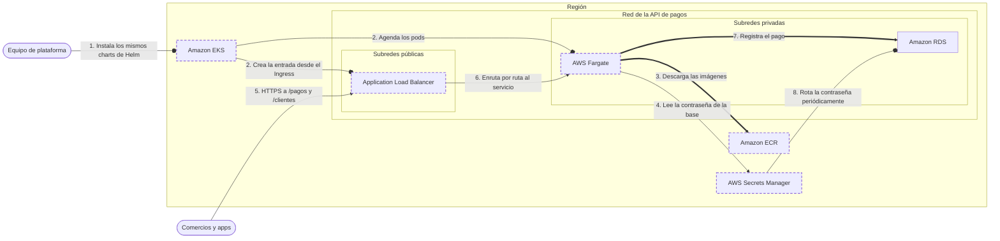

<!-- Archivo generado por pnpm content:gen a partir de scenario.yaml. No se edita a mano. -->

# Migrar una API de pagos en Kubernetes sin reescribir sus charts

> ⚠️ **Spoilers:** esta ficha contiene las respuestas del escenario. Si lo querés jugar, no sigas leyendo.

Una fintech lleva a la nube sus microservicios en Kubernetes: mismos charts de Helm, sin operar el plano de control ni servidores.

| Campo | Valor |
|---|---|
| Id | `kubernetes-api-migration` |
| Versión | 1 |
| Estado | draft |
| Nivel | 200 |
| Áreas | `containers`, `networking` |
| Duración estimada | 10 min |
| Autores | @elissamburu |
| Paleta | auto |

## Contexto

Una **fintech chica** corre hoy su **API de pagos** en un clúster de **Kubernetes** que
administra ella misma en servidores propios. La API es HTTP y está partida en varios
microservicios: `/pagos`, `/clientes` y algunos más.

El equipo ya tiene todos los **manifiestos y charts de Helm**, probados durante años, y
quiere migrar a AWS **sin reescribirlos**: puede ajustar valores y anotaciones, pero no
pasarse a otro orquestador. Lo que más le pesa hoy es mantener el plano de control
(actualizaciones, certificados, la base de datos del clúster) y los servidores donde
corren los contenedores; en la nube no quiere hacer ninguna de las dos cosas.

La API guarda los pagos en una base **PostgreSQL**, que se migra a una base administrada.
Hoy la contraseña de esa base viaja en **variables de entorno** definidas en los valores
de Helm, en texto plano: auditoría lo marcó como hallazgo crítico y además pide que la
contraseña se rote de forma periódica.

## Objetivos

| Id | Tipo | Categoría | Objetivo |
|---|---|---|---|
| `keep-kubernetes` | Restricción | team | Seguir usando Kubernetes y los charts de Helm existentes, sin migrar a otro orquestador; se permiten cambios de valores y anotaciones. |
| `no-control-plane` | Restricción | operations | No instalar, actualizar ni operar el plano de control de Kubernetes. |
| `no-plaintext-credentials` | Restricción | security | Las credenciales de la base no pueden quedar en texto plano en la configuración de los contenedores (manifiestos, valores de Helm ni variables de entorno). |
| `minimal-servers` | Meta | operations | Administrar lo mínimo posible los servidores donde corren los contenedores: ni tipos de instancia, ni parches del sistema operativo, ni escalado de nodos. |
| `path-routing` | Meta | traffic | Un único punto de entrada HTTP que enrute por ruta (/pagos, /clientes) hacia distintos servicios. |
| `managed-rotation` | Meta | security | Rotar periódicamente la contraseña de la base sin que el equipo programe ni opere esa rotación. |

## Diagrama con las respuestas óptimas

Los casilleros tienen borde punteado.

## Respuestas

### Casillero `orchestrator`

> Plano de control de Kubernetes administrado por AWS: recibe los charts de Helm de siempre y agenda los pods.

| Servicio | Grado | Objetivos | Justificación | Referencias |
|---|---|---|---|---|
| Amazon EKS (`eks`) | 🟢 Óptimo | `keep-kubernetes`, `no-control-plane` | Está certificado como Kubernetes conforme: los mismos manifiestos y charts de Helm se despliegan sin refactorizar, con `kubectl` y `helm` como hoy. AWS administra el plano de control: los componentes que agendan cargas y guardan el estado del clúster se operan y escalan por vos, así que el equipo no instala ni mantiene ninguno. | [1](https://docs.aws.amazon.com/eks/latest/userguide/what-is-eks.html) [2](https://docs.aws.amazon.com/eks/latest/userguide/kubernetes-versions.html) |
| Amazon ECS (`ecs`) | 🔴 Incorrecto | viola `keep-kubernetes` | Es un orquestador propio de AWS, con definiciones de tareas y servicios en su propio formato: no lee manifiestos de Kubernetes ni charts de Helm. Habría que reescribir todo el despliegue. |  |
| Amazon EC2 (`ec2`) | 🔴 Incorrecto | viola `no-control-plane` | Podés instalar Kubernetes en máquinas virtuales, pero el plano de control vuelve a ser tuyo: versiones, certificados, respaldos de etcd y alta disponibilidad. Es justo lo que el equipo quiere dejar de hacer. |  |
| AWS Fargate (`fargate`) | 🔴 Incorrecto | — | Pone la capacidad donde corren los pods, pero no es un orquestador: no expone la API de Kubernetes ni agenda nada por sí solo. Va en otro lugar del diagrama. |  |
| AWS App Runner (`app-runner`) | 🔴 Incorrecto | viola `keep-kubernetes` | Corre una aplicación web a partir de una imagen o del código, con su propia configuración; no acepta manifiestos de Kubernetes ni charts de Helm. |  |

Pistas:

1. Buscá un servicio que hable la misma API que el clúster de hoy.
2. Es la opción de Kubernetes administrado de AWS, no el orquestador propio de AWS.

### Casillero `pod-capacity`

> Capacidad de cómputo donde corren los pods de los microservicios, en las subredes privadas.

| Servicio | Grado | Objetivos | Justificación | Referencias |
|---|---|---|---|---|
| AWS Fargate (`fargate`) | 🟢 Óptimo | `minimal-servers`, `keep-kubernetes` | Cada pod corre en su propia capacidad aislada y del tamaño justo: no hay instancias que elegir, parchear ni escalar. Solo se agrega un perfil que dice qué namespaces corren ahí; los manifiestos no cambian. Tiene límites (no corre DaemonSets, contenedores privilegiados ni GPU, y solo usa subredes privadas) que esta API no necesita. Sus pods toman permisos de IAM con roles para cuentas de servicio (IRSA). | [1](https://docs.aws.amazon.com/eks/latest/userguide/fargate.html) [2](https://docs.aws.amazon.com/eks/latest/userguide/fargate-profile.html) |
| Amazon EC2 (`ec2`) | 🟠 Aceptable | `minimal-servers` | Con grupos de nodos administrados funciona muy bien: AWS crea las instancias y las drena al actualizarlas. Pero seguís eligiendo tipos de instancia, dimensionando el escalado y desplegando las AMI con los parches de seguridad. A cambio, los nodos admiten DaemonSets, como el driver que monta secretos como archivos. | [1](https://docs.aws.amazon.com/eks/latest/userguide/managed-node-groups.html) [2](https://docs.aws.amazon.com/eks/latest/userguide/eks-compute.html) |
| AWS Lambda (`lambda`) | 🔴 Incorrecto | viola `keep-kubernetes` | Ejecuta funciones disparadas por eventos, no pods: los Deployments y Services de los charts no tienen dónde correr y habría que reescribir la API como funciones. |  |
| Amazon ECS (`ecs`) | 🔴 Incorrecto | viola `keep-kubernetes` | Es otro orquestador, no capacidad para los pods de este clúster: sus tareas se definen en su propio formato, fuera de Kubernetes. |  |

Pistas:

1. Pensá en quién parchea el sistema operativo y quién decide cuántas máquinas hay.
2. Hay una opción donde cada pod recibe su propia capacidad y no existen nodos para administrar.

### Casillero `image-registry`

> Registro privado de las imágenes de los microservicios, del que el clúster descarga cada versión.

| Servicio | Grado | Objetivos | Justificación | Referencias |
|---|---|---|---|---|
| Amazon ECR (`ecr`) | 🟢 Óptimo | `keep-kubernetes` | Registro de imágenes administrado: no hay servidor de registro que operar. Los charts solo cambian el valor de la imagen al nombre completo del repositorio, y los pods en capacidad sin servidores descargan las imágenes privadas con su rol de ejecución. | [1](https://docs.aws.amazon.com/AmazonECR/latest/userguide/ECR_on_EKS.html) [2](https://docs.aws.amazon.com/AmazonECR/latest/userguide/what-is-ecr.html) |
| Amazon S3 (`s3`) | 🔴 Incorrecto | — | Guarda objetos, pero no implementa la API de registro que usan los nodos para descargar imágenes: el pod no podría referenciar una imagen guardada ahí. |  |
| AWS CodeBuild (`codebuild`) | 🔴 Incorrecto | — | Puede construir las imágenes en el pipeline, pero no las guarda ni las sirve: necesita un registro donde publicarlas. |  |

Pistas:

1. Buscá un registro de contenedores administrado, no un almacén genérico.

### Casillero `http-entry`

> Punto de entrada HTTP único que se crea desde los recursos Ingress y reparte los pedidos entre los pods de cada servicio.

| Servicio | Grado | Objetivos | Justificación | Referencias |
|---|---|---|---|---|
| Application Load Balancer (`alb`) | 🟢 Óptimo | `path-routing`, `keep-kubernetes` | El AWS Load Balancer Controller lo crea a partir de los Ingress existentes, con reglas por ruta (`/pagos/*`, `/clientes/*`) hacia cada Service; con un IngressGroup varios Ingress comparten un solo balanceador. Con pods en capacidad sin servidores hay que anotar `target-type: ip`, un cambio de anotación que el objetivo permite. | [1](https://docs.aws.amazon.com/eks/latest/userguide/alb-ingress.html) [2](https://docs.aws.amazon.com/elasticloadbalancing/latest/application/rule-condition-types.html) |
| Network Load Balancer (`nlb`) | 🟠 Aceptable | `path-routing` | Llega a los pods y funciona como entrada, pero balancea en capa 4: no ve la ruta HTTP. Para separar `/pagos` de `/clientes` necesitás un balanceador por servicio o instalar y operar un controlador de Ingress propio detrás. Conviene para tráfico TCP/UDP, no para enrutar HTTP. | [1](https://docs.aws.amazon.com/eks/latest/userguide/network-load-balancing.html) [2](https://docs.aws.amazon.com/elasticloadbalancing/latest/network/introduction.html) |
| Amazon API Gateway (`apigateway`) | 🔴 Incorrecto | — | Enruta rutas de una API, pero no se crea desde los Ingress del clúster y no llega directo a los pods: igual necesita un balanceador interno detrás, conectado por un enlace de VPC. |  |
| Amazon CloudFront (`cloudfront`) | 🔴 Incorrecto | — | Es una red de entrega de contenido: cachea y acerca respuestas al usuario, pero necesita un origen al que reenviar los pedidos. No reemplaza al balanceador que llega a los pods. |  |

Pistas:

1. Tiene que entender HTTP para mirar la ruta del pedido.
2. El clúster lo crea solo cuando aplicás un recurso Ingress con el controlador de balanceadores de AWS.

### Casillero `db-credentials`

> Almacén cifrado de la contraseña de la base, que los pods consultan con la identidad de su cuenta de servicio.

| Servicio | Grado | Objetivos | Justificación | Referencias |
|---|---|---|---|---|
| AWS Secrets Manager (`secrets-manager`) | 🟢 Óptimo | `no-plaintext-credentials`, `managed-rotation` | Guarda la contraseña cifrada, y la base puede delegarle su contraseña maestra, que se rota cada siete días por defecto. En capacidad sin servidores no corre el driver CSI (es un DaemonSet) ni Pod Identity: el pod la lee con el SDK usando IRSA y la vuelve a leer si cambia. Nada queda en los valores de Helm. | [1](https://docs.aws.amazon.com/AmazonRDS/latest/UserGuide/rds-secrets-manager.html) [2](https://docs.aws.amazon.com/secretsmanager/latest/userguide/retrieving-secrets.html) [3](https://docs.aws.amazon.com/eks/latest/userguide/iam-roles-for-service-accounts.html) [4](https://docs.aws.amazon.com/eks/latest/userguide/manage-secrets.html) |
| AWS Systems Manager (`systems-manager`) | 🟠 Aceptable | `managed-rotation` | Un parámetro SecureString guarda la contraseña cifrada y el pod la lee igual, con el SDK e IRSA: cumple la restricción. Pero no rota credenciales; habría que programar y operar la rotación. Su propia documentación recomienda otro servicio para credenciales de bases de datos. | [1](https://docs.aws.amazon.com/systems-manager/latest/userguide/systems-manager-parameter-store.html) |
| AWS KMS (`kms`) | 🔴 Incorrecto | — | Administra las claves que cifran los datos, pero no guarda ni entrega la contraseña: igual necesitarías un lugar donde dejarla cifrada y un proceso para rotarla. |  |
| AWS IAM (`iam`) | 🔴 Incorrecto | — | Da al pod la identidad con la que pide el secreto, pero no guarda secretos. La autenticación de IAM a la base evitaría la contraseña, pero cambia cómo se conecta la API; este casillero pide dónde guardar y rotar la contraseña que ya usa. |  |
| AWS Certificate Manager (`acm`) | 🔴 Incorrecto | — | Administra certificados TLS para conexiones HTTPS; no guarda contraseñas de bases de datos. |  |

Pistas:

1. Buscá un servicio hecho para secretos, no para configuración general ni para claves de cifrado.
2. El mejor candidato también puede rotar la contraseña de la base por su cuenta.

## Referencias

- [Amazon EKS: qué es](https://docs.aws.amazon.com/eks/latest/userguide/what-is-eks.html)
- [Consideraciones de Fargate en Amazon EKS](https://docs.aws.amazon.com/eks/latest/userguide/fargate.html)
- [Enrutar tráfico HTTP con Application Load Balancers en EKS](https://docs.aws.amazon.com/eks/latest/userguide/alb-ingress.html)
