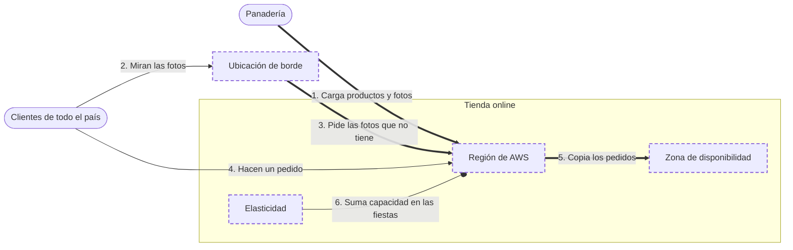

<!-- Archivo generado por pnpm content:gen a partir de scenario.yaml. No se edita a mano. -->

# Una panadería que vende online en todo el país

> ⚠️ **Spoilers:** esta ficha contiene las respuestas del escenario. Si lo querés jugar, no sigas leyendo.

Una panadería de Rosario vende online a todo el país: tiene que seguir vendiendo si falla un edificio, mostrar las fotos rápido y aguantar la Navidad.

| Campo | Valor |
|---|---|
| Id | `panaderia-online` |
| Versión | 1 |
| Estado | beta |
| Nivel | 0 |
| Áreas | `fundamentos`, `networking` |
| Duración estimada | 4 min |
| Autores | @elissamburu |
| Paleta | auto |

## Contexto

Una panadería de Rosario empezó a vender online y le compran de todo el país. En Navidad
recibe diez veces más pedidos que en enero. Si se corta la luz en el edificio donde funciona
la tienda, no quiere quedarse sin vender.

## Objetivos

| Id | Tipo | Categoría | Objetivo |
|---|---|---|---|
| `building-failure` | Restricción | availability | Si falla un edificio entero, la tienda sigue vendiendo. |
| `fast-everywhere` | Meta | latency | La tienda y las fotos de los productos cargan rápido en cualquier provincia. |
| `seasonal-demand` | Meta | scalability | En las fiestas atiende todos los pedidos y en enero no paga capacidad de más. |

## Diagrama con las respuestas óptimas

Los casilleros tienen borde punteado.

## Respuestas

### Casillero `main-place`

> El punto del mapa donde funciona la tienda, elegido por estar cerca de la mayoría de los clientes.

| Servicio | Grado | Objetivos | Justificación | Referencias |
|---|---|---|---|---|
| Región de AWS (`region`) | 🟢 Óptimo | `fast-everywhere` | Elegir una región cerca de la mayoría de los clientes baja la latencia: los pedidos y las fotos viajan menos. | [1](https://docs.aws.amazon.com/global-infrastructure/latest/regions/aws-regions-availability-zones.html) |
| Ubicación de borde (`edge-location`) | 🔴 Incorrecto | — | Solo guarda copias de lo más pedido; ahí no funciona la tienda. |  |

### Casillero `backup`

> Una segunda copia de la tienda en otro edificio, cerca del primero, por si ese falla.

| Servicio | Grado | Objetivos | Justificación | Referencias |
|---|---|---|---|---|
| Zona de disponibilidad (`availability-zone`) | 🟢 Óptimo | `building-failure` | Cada región tiene varias zonas, separadas físicamente y con energía y red propias. Con una copia de la tienda en otra zona, la falla de un edificio entero no la deja sin vender. | [1](https://docs.aws.amazon.com/global-infrastructure/latest/regions/aws-regions-availability-zones.html) |
| Región de AWS (`region`) | 🟠 Aceptable | `fast-everywhere` | Una copia en otra región también sobrevive a la falla de un edificio, pero queda más lejos de los clientes y los datos no se copian solos de una región a otra. | [1](https://docs.aws.amazon.com/global-infrastructure/latest/regions/aws-regions-availability-zones.html) |
| Ubicación de borde (`edge-location`) | 🔴 Incorrecto | viola `building-failure` | No puede tomar pedidos si la tienda se cae: solo guarda copias de lo más pedido. |  |

### Casillero `photos`

> Copias de las fotos de los productos repartidas por el país, para que carguen rápido.

| Servicio | Grado | Objetivos | Justificación | Referencias |
|---|---|---|---|---|
| Ubicación de borde (`edge-location`) | 🟢 Óptimo | `fast-everywhere` | Guarda copias de las fotos cerca de quien las pide: cada pedido se atiende desde la ubicación más cercana y las fotos cargan más rápido en cualquier provincia. | [1](https://docs.aws.amazon.com/AmazonCloudFront/latest/DeveloperGuide/HowCloudFrontWorks.html) |
| Amazon S3 (`s3`) | 🔴 Incorrecto | — | Guarda las fotos, pero en un solo lugar: no las acerca a cada provincia. |  |

### Casillero `scaling`

> Sumar capacidad en las fiestas y sacarla en enero, sin comprar equipos.

| Servicio | Grado | Objetivos | Justificación | Referencias |
|---|---|---|---|---|
| Elasticidad (`elasticity`) | 🟢 Óptimo | `seasonal-demand` | La tienda usa tanta capacidad como necesita: la suma en las fiestas, cuando llegan diez veces más pedidos, y la saca en enero, sin comprar equipos ni pagar capacidad que no usa. | [1](https://docs.aws.amazon.com/whitepapers/latest/aws-overview/six-advantages-of-cloud-computing.html) |
| Alta disponibilidad (`high-availability`) | 🔴 Incorrecto | — | Sirve para seguir andando ante fallas, no para atender más pedidos. |  |
| Pago por uso (`pay-as-you-go`) | 🔴 Incorrecto | — | Dice cómo pagás, no suma capacidad. |  |
