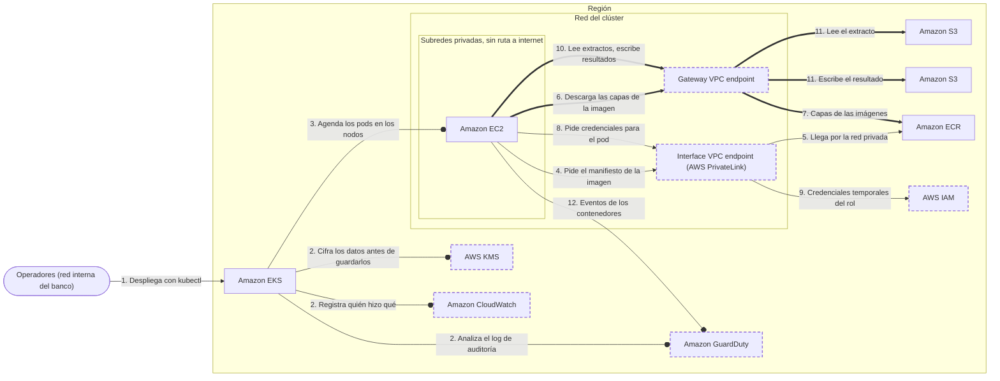

<!-- Archivo generado por pnpm content:gen a partir de scenario.yaml. No se edita a mano. -->

# Extractos bancarios en un clúster EKS sin salida a internet

> ⚠️ **Spoilers:** esta ficha contiene las respuestas del escenario. Si lo querés jugar, no sigas leyendo.

Un banco procesa extractos en Kubernetes sin ninguna ruta a internet, con un rol por workload, Secrets cifrados con su propia clave, auditoría y detección de amenazas.

| Campo | Valor |
|---|---|
| Id | `private-eks-least-privilege` |
| Versión | 1 |
| Estado | draft |
| Nivel | 300 |
| Áreas | `containers`, `security`, `networking` |
| Duración estimada | 14 min |
| Autores | @elissamburu |
| Paleta | auto |

## Contexto

Un **banco** procesa los **extractos de sus clientes** en un clúster de **EKS**. El servicio
de extractos lee cada archivo de un **bucket de S3 de entrada** y escribe el resultado en
un **bucket de salida**: entre los dos mueve **cientos de GB por día**.

El área de seguridad exige **detectar amenazas en tiempo de ejecución** con un agente que
corre como DaemonSet en cada nodo y observa la actividad de los contenedores. Ese agente no
funciona sobre capacidad serverless: por eso los pods corren en **grupos de nodos
administrados sobre EC2**. Las imágenes se descargan de **ECR**.

La normativa del banco es estricta:

- las subredes del clúster **no tienen ninguna ruta a internet**, ni de entrada ni de salida;
- el endpoint de la **API del clúster es privado**: los operadores llegan desde la red
  interna del banco;
- en el entorno de pruebas, el servicio usa **claves de acceso** guardadas en un Secret de
  Kubernetes. Auditoría lo marcó como hallazgo crítico: en producción, cada workload tiene
  que tener **solo los permisos que necesita** y ningún pod puede aprovechar los permisos
  de los nodos;
- los **Secrets de Kubernetes** se cifran con una clave que el banco controla: define
  quién puede usarla, la rota y audita cada uso;
- hay que poder responder **quién ejecutó qué acción** contra la API de Kubernetes;
- hay que detectar **actividad sospechosa**, tanto en los pedidos a la API de Kubernetes
  como dentro de los contenedores en ejecución.

## Objetivos

| Id | Tipo | Categoría | Objetivo |
|---|---|---|---|
| `no-internet-route` | Restricción | compliance | Ninguna subred del clúster tiene ruta a internet, ni de entrada ni de salida: todo el tráfico hacia los servicios de AWS es privado. |
| `no-long-lived-credentials` | Restricción | security | Ningún pod usa credenciales de larga duración (claves de acceso) ni los permisos del rol de los nodos. |
| `least-privilege-per-workload` | Restricción | security | Cada workload tiene su propio rol, con solo los permisos que necesita. |
| `customer-managed-key` | Restricción | compliance | Los Secrets de Kubernetes se cifran con una clave administrada por el cliente: el banco define su política de acceso, su rotación y audita cada uso. |
| `low-s3-traffic-cost` | Meta | cost | Minimizar el costo del tráfico hacia los buckets, que mueve cientos de GB por día. |
| `k8s-audit` | Meta | compliance | Poder auditar quién ejecutó qué acción contra la API de Kubernetes del clúster. |
| `threat-detection` | Restricción | security | Detectar actividad sospechosa en el clúster, tanto en los pedidos a la API de Kubernetes como dentro de los contenedores en ejecución. |

## Diagrama con las respuestas óptimas

Los casilleros tienen borde punteado.

## Respuestas

### Casillero `workload-identity`

> Identidad propia del servicio de extractos: le entrega credenciales temporales con acceso solo a sus dos buckets.

| Servicio | Grado | Objetivos | Justificación | Referencias |
|---|---|---|---|---|
| AWS IAM (`iam`) | 🟢 Óptimo | `no-long-lived-credentials`, `least-privilege-per-workload` | Un rol por cuenta de servicio, con EKS Pod Identity (o IRSA): el pod recibe credenciales temporales que se renuevan solas, sin claves en el pod. La política del rol permite solo leer el bucket de entrada y escribir el de salida. Como el pod igual podría heredar el rol del nodo, la guía de buenas prácticas de EKS recomienda bloquear su acceso a los metadatos de la instancia (IMDSv2 con límite de saltos 1). | [1](https://docs.aws.amazon.com/eks/latest/userguide/pod-id-how-it-works.html) [2](https://docs.aws.amazon.com/eks/latest/best-practices/identity-and-access-management.html) |
| AWS Secrets Manager (`secrets-manager`) | 🔴 Incorrecto | viola `no-long-lived-credentials` | Guardar ahí las claves de acceso del servicio las protege mejor que un Secret, pero siguen siendo credenciales de larga duración: si se filtran, sirven hasta que alguien las rote. El pod tiene que recibir credenciales temporales de un rol. |  |
| AWS IAM Identity Center (`iam-identity-center`) | 🔴 Incorrecto | — | Es el acceso de las personas de la organización (fuerza laboral) a las cuentas y aplicaciones, con inicio de sesión único. No le da identidad a un pod. |  |
| Amazon Cognito (`cognito`) | 🔴 Incorrecto | — | Es el registro e inicio de sesión de los usuarios finales de una aplicación web o móvil. No sirve para que un workload del clúster obtenga permisos sobre los buckets. |  |

Pistas:

1. El pod no debería tener ninguna clave guardada: las credenciales tienen que ser temporales.
2. Asociá la cuenta de servicio de Kubernetes con un rol que solo tenga los permisos del servicio.

### Casillero `s3-access`

> Acceso privado a los buckets desde las subredes del clúster, por donde pasan los extractos y también las capas de las imágenes.

| Servicio | Grado | Objetivos | Justificación | Referencias |
|---|---|---|---|---|
| Gateway VPC endpoint (`vpc-gateway-endpoint`) | 🟢 Óptimo | `no-internet-route`, `low-s3-traffic-cost` | Una ruta en las tablas de las subredes hacia S3, sin cargo por hora ni por GB. En un clúster privado es imprescindible también para arrancar pods: ECR guarda las capas de las imágenes en S3, y su guía pide este acceso por ruta para bajarlas. Si se restringe con una política, hay que permitir el bucket de capas de ECR además de los del banco. | [1](https://docs.aws.amazon.com/AmazonECR/latest/userguide/vpc-endpoints.html) [2](https://docs.aws.amazon.com/vpc/latest/privatelink/gateway-endpoints.html) |
| Interface VPC endpoint (AWS PrivateLink) (`vpc-interface-endpoint`) | 🔴 Incorrecto | — | Serviría para leer y escribir los extractos por la red privada, pero cobra por hora en cada zona y por GB, con cientos de GB por día. Y la guía de ECR pide un acceso por ruta a S3 para las capas de las imágenes: sin él, los nodos no bajan las capas y los pods no arrancan. |  |
| NAT gateway (`nat-gateway`) | 🔴 Incorrecto | viola `no-internet-route` | Necesita una subred pública con ruta a la salida a internet de la VPC: justo lo que la normativa prohíbe. Además cobra por hora y por cada GB que procesa. |  |
| Internet gateway (`internet-gateway`) | 🔴 Incorrecto | viola `no-internet-route` | Es la salida a internet de la VPC: una subred del clúster con ruta hacia él rompe la normativa. |  |

Pistas:

1. Por acá no pasan solo los extractos: pensá de dónde salen las capas de las imágenes.
2. Para este servicio existe un acceso privado que es solo una ruta y no tiene cargo.

### Casillero `aws-apis-access`

> Acceso privado desde los nodos y los pods a las APIs de AWS que necesitan para arrancar y obtener sus credenciales.

| Servicio | Grado | Objetivos | Justificación | Referencias |
|---|---|---|---|---|
| Interface VPC endpoint (AWS PrivateLink) (`vpc-interface-endpoint`) | 🟢 Óptimo | `no-internet-route` | Uno por API, con DNS privado: `ecr.api` y `ecr.dkr` (imágenes; las capas van por el acceso a S3), `eks-auth` (credenciales de Pod Identity; con IRSA, `sts`), `ec2` (la AMI optimizada fija el nombre DNS del nodo), `eks` (API de EKS) y `logs` si se envían logs de nodos y pods. Los nodos se registran por el acceso privado al endpoint del clúster. Cada endpoint acepta 443 desde las subredes de los nodos. | [1](https://docs.aws.amazon.com/eks/latest/userguide/private-clusters.html) [2](https://docs.aws.amazon.com/eks/latest/userguide/vpc-interface-endpoints.html) |
| NAT gateway (`nat-gateway`) | 🔴 Incorrecto | viola `no-internet-route` | Llegaría a las APIs por sus puntos de acceso públicos a través de la salida a internet de la VPC, que la normativa prohíbe. |  |
| AWS Direct Connect (`direct-connect`) | 🔴 Incorrecto | — | Es un enlace dedicado entre la red propia del banco y AWS: sirve para que los operadores lleguen a la VPC, no para que los nodos lleguen a las APIs de AWS. |  |
| Gateway VPC endpoint (`vpc-gateway-endpoint`) | 🔴 Incorrecto | — | El acceso por ruta solo existe para S3 y DynamoDB; ECR, las credenciales de los pods y las APIs de EC2 y EKS no lo ofrecen. |  |

Pistas:

1. Sin salida a internet, cada API de AWS que usan los nodos o los pods necesita su propia puerta privada.
2. No te olvides de la API que entrega las credenciales temporales de los pods.

### Casillero `secrets-key`

> Clave con la que el plano de control cifra los Secrets y el resto de los datos de la API antes de guardarlos.

| Servicio | Grado | Objetivos | Justificación | Referencias |
|---|---|---|---|---|
| AWS KMS (`kms`) | 🟢 Óptimo | `customer-managed-key` | Desde Kubernetes 1.28, EKS ya cifra todos los datos de la API con una clave propiedad de AWS, pero el banco no la ve ni la controla. Con una clave administrada por el cliente, el banco define la política de la clave, activa la rotación automática y cada uso queda registrado en la cuenta. Si la deshabilita, el clúster se degrada: hay que proteger quién puede administrarla. | [1](https://docs.aws.amazon.com/eks/latest/userguide/envelope-encryption.html) [2](https://docs.aws.amazon.com/kms/latest/developerguide/rotate-keys.html) |
| AWS Secrets Manager (`secrets-manager`) | 🔴 Incorrecto | — | Guarda y rota secretos de aplicaciones, pero no es la clave con la que el plano de control cifra lo que guarda la API de Kubernetes. |  |
| AWS Certificate Manager (`acm`) | 🔴 Incorrecto | — | Emite y renueva certificados TLS para cifrar el tráfico en tránsito; no cifra los datos que guarda el clúster. |  |
| AWS Systems Manager (`systems-manager`) | 🔴 Incorrecto | — | Su almacén de parámetros guarda configuración, incluso cifrada, pero no puede ser la clave de cifrado de los datos de la API del clúster. |  |

Pistas:

1. EKS ya cifra estos datos por defecto: la diferencia está en quién controla la clave.
2. Buscá el servicio de claves criptográficas que te deja definir la política y la rotación.

### Casillero `audit-logs`

> Destino del registro de auditoría del plano de control: cada pedido a la API de Kubernetes, con quién lo hizo.

| Servicio | Grado | Objetivos | Justificación | Referencias |
|---|---|---|---|---|
| Amazon CloudWatch (`cloudwatch`) | 🟢 Óptimo | `k8s-audit` | El registro de auditoría es un tipo de log del plano de control que viene apagado: al activarlo, EKS lo envía a CloudWatch Logs de la cuenta, con el usuario, el verbo y el recurso de cada pedido a la API de Kubernetes. Se paga la ingesta y el almacenamiento de los logs. | [1](https://docs.aws.amazon.com/eks/latest/userguide/control-plane-logs.html) |
| AWS CloudTrail (`cloudtrail`) | 🔴 Incorrecto | — | Registra las llamadas a la API de AWS, como crear el clúster o cambiar su configuración, y las de los pods a otros servicios. Un kubectl que borra un pod es un pedido a la API de Kubernetes y queda en el log de auditoría del plano de control, no ahí. |  |
| Amazon GuardDuty (`guardduty`) | 🔴 Incorrecto | — | Analiza el log de auditoría con su propio flujo para detectar amenazas, pero no lo deja disponible en la cuenta: para consultar quién hizo qué, hay que activar el envío de los logs del plano de control. |  |
| AWS Config (`config`) | 🔴 Incorrecto | — | Registra cómo cambia la configuración de los recursos de AWS y evalúa reglas de cumplimiento; no ve cada pedido a la API de Kubernetes. |  |
| AWS X-Ray (`x-ray`) | 🔴 Incorrecto | — | Traza pedidos de una aplicación a través de sus componentes para ver latencias y errores; no audita quién ejecutó qué en el clúster. |  |

Pistas:

1. Una acción de kubectl no es una llamada a la API de AWS: queda en otro registro.
2. Es uno de los tipos de log del plano de control que se activan por clúster.

### Casillero `threat-detection`

> Detección de amenazas: analiza los pedidos a la API de Kubernetes y la actividad de los contenedores en ejecución.

| Servicio | Grado | Objetivos | Justificación | Referencias |
|---|---|---|---|---|
| Amazon GuardDuty (`guardduty`) | 🟢 Óptimo | `threat-detection`, `no-internet-route` | EKS Protection analiza el log de auditoría con un flujo propio: no hace falta activar los logs del plano de control. Runtime Monitoring agrega un agente, instalado como add-on de EKS, que observa los contenedores en cada nodo; no soporta Fargate. Con la configuración automática, GuardDuty instala el agente y crea el endpoint de VPC `guardduty-data`, sin costo adicional: funciona sin salida a internet. | [1](https://docs.aws.amazon.com/guardduty/latest/ug/kubernetes-protection.html) [2](https://docs.aws.amazon.com/guardduty/latest/ug/how-runtime-monitoring-works-eks.html) |
| Amazon Inspector (`inspector`) | 🔴 Incorrecto | — | Escanea imágenes de contenedores e instancias en busca de vulnerabilidades conocidas: dice qué podría explotarse, no detecta comportamiento sospechoso en el clúster mientras corre. |  |
| AWS Security Hub (`security-hub`) | 🔴 Incorrecto | — | Reúne, correlaciona y prioriza hallazgos de otros servicios y controles de buenas prácticas; no genera por sí mismo detecciones a partir del log de auditoría ni de la actividad de los contenedores. |  |
| Amazon Detective (`detective`) | 🔴 Incorrecto | — | Sirve para investigar un hallazgo después de que ocurrió, reconstruyendo su contexto; no es el que detecta la actividad sospechosa. |  |
| Amazon Macie (`macie`) | 🔴 Incorrecto | — | Descubre datos sensibles, como información personal, en los buckets; no analiza la API de Kubernetes ni los contenedores. |  |

Pistas:

1. Buscá el servicio que genera los hallazgos, no el que los agrega ni el que los investiga.
2. Tiene una protección específica para el clúster y un agente que corre en cada nodo.

## Referencias

- [Clústeres privados de EKS](https://docs.aws.amazon.com/eks/latest/userguide/private-clusters.html)
- [Cifrado por defecto de los datos de la API de Kubernetes](https://docs.aws.amazon.com/eks/latest/userguide/envelope-encryption.html)
- [Mejores prácticas de EKS: identidad y acceso](https://docs.aws.amazon.com/eks/latest/best-practices/identity-and-access-management.html)
