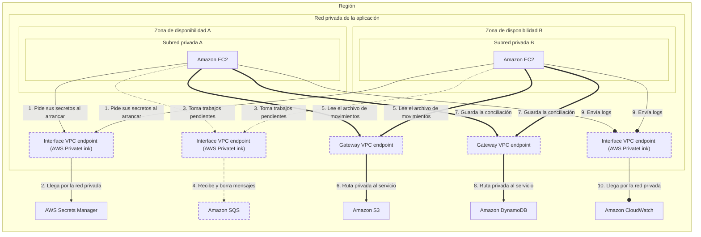

<!-- Archivo generado por pnpm content:gen a partir de scenario.yaml. No se edita a mano. -->

# Una aplicación en subredes privadas que no puede salir a internet

> ⚠️ **Spoilers:** esta ficha contiene las respuestas del escenario. Si lo querés jugar, no sigas leyendo.

Una aplicación en dos zonas usa almacenamiento, una base NoSQL, secretos, una cola y logs sin ninguna ruta hacia internet.

| Campo | Valor |
|---|---|
| Id | `private-vpc-service-access` |
| Versión | 1 |
| Estado | draft |
| Nivel | 300 |
| Áreas | `networking`, `security` |
| Duración estimada | 12 min |
| Autores | @elissamburu |
| Paleta | auto |

## Contexto

Una fintech corre su **servicio de conciliación** en instancias dentro de **subredes
privadas** de una VPC, repartidas en **dos zonas de disponibilidad**. Durante el día, el
servicio:

- toma trabajos pendientes de una **cola de mensajes** que alimenta otro sistema;
- lee archivos de movimientos desde **S3** y guarda los resultados en **DynamoDB**:
  entre ambos mueve **cientos de GB por día**;
- obtiene sus claves y credenciales desde **Secrets Manager** al arrancar;
- envía sus logs a **CloudWatch**.

El área de seguridad fue terminante: la VPC **no tiene ni puede tener salida a internet**.
Todo el tráfico hacia los servicios de AWS tiene que llegar por conectividad privada.

El equipo de plataforma es chico: prefiere pocas piezas para configurar y nada que
dimensionar o parchear. Y el costo de la conectividad está bajo la lupa.

## Objetivos

| Id | Tipo | Categoría | Objetivo |
|---|---|---|---|
| `no-internet` | Restricción | security | La VPC no tiene ni puede tener salida a internet: el tráfico hacia los servicios de AWS viaja por conectividad privada. |
| `low-cost` | Meta | cost | Mantener bajo el costo de la conectividad, que mueve cientos de GB por día. |
| `simple-ops` | Meta | operations | Operación simple: pocas piezas para configurar y nada que dimensionar ni parchear. |
| `multi-az` | Meta | availability | Si una zona de disponibilidad falla, las instancias de la otra siguen llegando a todos los servicios. |

## Diagrama con las respuestas óptimas

Los casilleros tienen borde punteado.

## Respuestas

### Casillero `objects-access`

> Acceso privado desde ambas subredes al almacenamiento de objetos; por acá pasa la mayor parte del volumen diario.

| Servicio | Grado | Objetivos | Justificación | Referencias |
|---|---|---|---|---|
| Gateway VPC endpoint (`vpc-gateway-endpoint`) | 🟢 Óptimo | `no-internet`, `low-cost`, `simple-ops` | Se asocia a las tablas de ruteo de las subredes y agrega una ruta hacia el servicio con una lista de prefijos administrada por AWS: no hace falta salida a internet ni cambiar la aplicación. No tiene cargo adicional, así que los cientos de GB diarios no suman costo de conectividad. | [1](https://docs.aws.amazon.com/vpc/latest/privatelink/gateway-endpoints.html) [2](https://docs.aws.amazon.com/vpc/latest/privatelink/vpc-endpoints-s3.html) |
| Interface VPC endpoint (AWS PrivateLink) (`vpc-interface-endpoint`) | 🟠 Aceptable | `low-cost` | También mantiene el tráfico privado, con IP de tus subredes, pero se cobra por hora en cada zona y por GB procesado: con cientos de GB por día pagás un costo que el acceso por ruta no tiene. Conviene cuando hay que llegar desde otra red (on-premises u otra región), que no es el caso. | [1](https://docs.aws.amazon.com/AmazonS3/latest/userguide/privatelink-interface-endpoints.html) [2](https://aws.amazon.com/privatelink/pricing/) |
| NAT gateway (`nat-gateway`) | 🔴 Incorrecto | viola `no-internet` | Da salida hacia afuera de la VPC: un NAT público vive en una subred pública y enruta hacia la salida a internet, justo lo que la restricción prohíbe. Además cobra por hora y por GB procesado. |  |
| Internet gateway (`internet-gateway`) | 🔴 Incorrecto | viola `no-internet` | Es la salida a internet de la VPC. Una subred con ruta hacia él deja de ser privada y rompe la restricción de seguridad. |  |
| AWS Transit Gateway (`transit-gateway`) | 🔴 Incorrecto | — | Interconecta VPCs y redes propias como un hub; por sí solo no da acceso privado a los servicios de AWS. |  |

Pistas:

1. Hay una forma de llegar a este servicio agregando solo una ruta, sin crear interfaces de red.
2. Esa opción existe únicamente para S3 y DynamoDB, y no tiene cargo adicional.

### Casillero `results-access`

> Acceso privado desde ambas subredes a la base NoSQL donde se guardan los resultados.

| Servicio | Grado | Objetivos | Justificación | Referencias |
|---|---|---|---|---|
| Gateway VPC endpoint (`vpc-gateway-endpoint`) | 🟢 Óptimo | `no-internet`, `low-cost`, `simple-ops` | Igual que para el almacenamiento de objetos: una ruta en las tablas de las subredes hacia la lista de prefijos del servicio, sin cargo adicional y sin cambiar la aplicación, que sigue usando el nombre regional habitual. | [1](https://docs.aws.amazon.com/vpc/latest/privatelink/gateway-endpoints.html) [2](https://docs.aws.amazon.com/vpc/latest/privatelink/vpc-endpoints-ddb.html) |
| Interface VPC endpoint (AWS PrivateLink) (`vpc-interface-endpoint`) | 🟠 Aceptable | `low-cost`, `simple-ops` | Funciona y el tráfico queda privado, pero se cobra por hora en cada zona y por GB, y los clientes tienen que configurarse con la URL específica del endpoint en lugar del nombre habitual del servicio: más costo y más configuración que el acceso por ruta. | [1](https://docs.aws.amazon.com/amazondynamodb/latest/developerguide/privatelink-interface-endpoints.html) [2](https://aws.amazon.com/privatelink/pricing/) |
| NAT gateway (`nat-gateway`) | 🔴 Incorrecto | viola `no-internet` | Requiere salida a internet (un NAT público en subred pública con ruta a la salida de la VPC), que la restricción prohíbe; y cobra por cada GB que procesa. |  |
| AWS Direct Connect (`direct-connect`) | 🔴 Incorrecto | — | Es un enlace dedicado entre un centro de datos propio y AWS; no resuelve cómo llegan las instancias de la VPC a la base. |  |

Pistas:

1. Mirá qué opción usaste para el almacenamiento de objetos: este servicio tiene la misma.

### Casillero `secrets-access`

> Acceso privado desde ambas subredes al almacén de secretos, que la aplicación consulta al arrancar.

| Servicio | Grado | Objetivos | Justificación | Referencias |
|---|---|---|---|---|
| Interface VPC endpoint (AWS PrivateLink) (`vpc-interface-endpoint`) | 🟢 Óptimo | `no-internet`, `multi-az`, `simple-ops` | Es la única forma privada de llegar a este servicio: crea una interfaz de red con IP privada en cada subred que elijas. Con una en cada zona, si una zona falla la otra sigue teniendo acceso. Con DNS privado habilitado, el SDK sigue usando el nombre habitual del servicio. | [1](https://docs.aws.amazon.com/secretsmanager/latest/userguide/vpc-endpoint-overview.html) [2](https://docs.aws.amazon.com/vpc/latest/privatelink/privatelink-access-aws-services.html) |
| Gateway VPC endpoint (`vpc-gateway-endpoint`) | 🔴 Incorrecto | — | Ese tipo de acceso por ruta solo existe para S3 y DynamoDB; este servicio no lo ofrece. |  |
| NAT gateway (`nat-gateway`) | 🔴 Incorrecto | viola `no-internet` | Llegaría al servicio por su punto de acceso público a través de la salida a internet de la VPC, que la restricción prohíbe. |  |

Pistas:

1. La única opción privada para este servicio pone interfaces de red dentro de tus subredes.
2. Para sobrevivir a la caída de una zona, necesitás presencia en las dos.

### Casillero `jobs-queue`

> Cola administrada donde otro sistema deja trabajos pendientes; el servicio los toma a su ritmo y los borra al terminarlos.

| Servicio | Grado | Objetivos | Justificación | Referencias |
|---|---|---|---|---|
| Amazon SQS (`sqs`) | 🟢 Óptimo | `simple-ops`, `low-cost` | Cola totalmente administrada: no hay broker que dimensionar ni parchear, retiene los mensajes hasta que el consumidor los procesa y cobra por pedido, sin mínimo. | [1](https://docs.aws.amazon.com/AWSSimpleQueueService/latest/SQSDeveloperGuide/sqs-visibility-timeout.html) [2](https://aws.amazon.com/sqs/pricing/) |
| Amazon MQ (`mq`) | 🟠 Aceptable | `simple-ops`, `low-cost` | Un broker administrado sirve si ya usás protocolos como AMQP o JMS, pero se paga por hora de instancia aunque no haya mensajes, y tenés que elegir tamaño y modo de despliegue y convivir con ventanas de mantenimiento. | [1](https://docs.aws.amazon.com/amazon-mq/latest/developer-guide/amazon-mq-basic-elements.html) [2](https://aws.amazon.com/amazon-mq/pricing/) |
| Amazon Kinesis Data Streams (`kinesis-data-streams`) | 🟠 Aceptable | `simple-ops`, `low-cost` | Un stream retiene los registros para varios consumidores, pero está pensado para ingesta y procesamiento continuo en tiempo real, no para una lista de trabajos que se toman y se borran; y en los modos habituales hay un cargo por hora (por stream o por shard) aunque no lleguen datos. | [1](https://docs.aws.amazon.com/streams/latest/dev/introduction.html) [2](https://aws.amazon.com/kinesis/data-streams/pricing/) |
| Amazon SNS (`sns`) | 🔴 Incorrecto | — | Empuja cada mensaje a sus suscriptores en el momento; no retiene trabajos para que el servicio los tome a su ritmo. |  |

Pistas:

1. Buscá un servicio de colas totalmente administrado, sin broker.

### Casillero `jobs-access`

> Acceso privado desde ambas subredes a la API de la cola de trabajos pendientes.

| Servicio | Grado | Objetivos | Justificación | Referencias |
|---|---|---|---|---|
| Interface VPC endpoint (AWS PrivateLink) (`vpc-interface-endpoint`) | 🟢 Óptimo | `no-internet`, `multi-az`, `simple-ops` | Interfaces de red con IP privada en las subredes de ambas zonas; con DNS privado, la aplicación sigue usando el nombre habitual del servicio y el tráfico no necesita ninguna salida a internet. | [1](https://docs.aws.amazon.com/AWSSimpleQueueService/latest/SQSDeveloperGuide/sqs-internetwork-traffic-privacy.html) [2](https://docs.aws.amazon.com/vpc/latest/privatelink/privatelink-access-aws-services.html) |
| Gateway VPC endpoint (`vpc-gateway-endpoint`) | 🔴 Incorrecto | — | El acceso por ruta solo existe para S3 y DynamoDB; la cola no lo ofrece. |  |
| NAT gateway (`nat-gateway`) | 🔴 Incorrecto | viola `no-internet` | Llegaría a la cola por su punto de acceso público a través de la salida a internet de la VPC, que la restricción prohíbe. |  |
| Internet gateway (`internet-gateway`) | 🔴 Incorrecto | viola `no-internet` | Es la salida a internet de la VPC; además, las instancias en subredes privadas no tienen ruta hacia él. |  |

Pistas:

1. Es el mismo tipo de acceso que usaste para los secretos.

### Casillero `logs-access`

> Acceso privado desde ambas subredes para enviar los logs de la aplicación al servicio de monitoreo.

| Servicio | Grado | Objetivos | Justificación | Referencias |
|---|---|---|---|---|
| Interface VPC endpoint (AWS PrivateLink) (`vpc-interface-endpoint`) | 🟢 Óptimo | `no-internet`, `multi-az`, `simple-ops` | El servicio de logs también se alcanza con interfaces de red privadas en cada zona. Casi todos los servicios de AWS se acceden así; el acceso por ruta es la excepción. | [1](https://docs.aws.amazon.com/AmazonCloudWatch/latest/logs/cloudwatch-logs-and-interface-VPC.html) [2](https://docs.aws.amazon.com/vpc/latest/privatelink/aws-services-privatelink-support.html) |
| Gateway VPC endpoint (`vpc-gateway-endpoint`) | 🔴 Incorrecto | — | El acceso por ruta solo existe para S3 y DynamoDB; el servicio de logs no lo ofrece. |  |
| NAT gateway (`nat-gateway`) | 🔴 Incorrecto | viola `no-internet` | Enviaría los logs por la salida a internet de la VPC, que la restricción prohíbe. |  |

Pistas:

1. ¿Qué tienen en común este servicio, los secretos y la cola, y en qué se diferencian de S3 y DynamoDB?

## Referencias

- [Acceso a servicios de AWS con AWS PrivateLink](https://docs.aws.amazon.com/vpc/latest/privatelink/privatelink-access-aws-services.html)
- [Gateway endpoints](https://docs.aws.amazon.com/vpc/latest/privatelink/gateway-endpoints.html)
