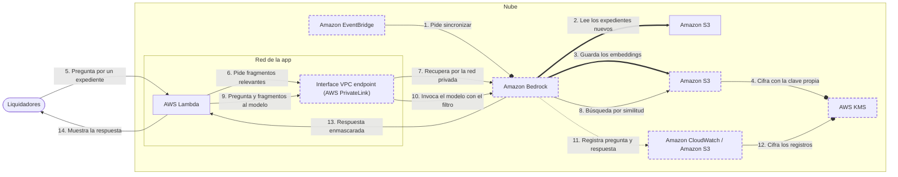

<!-- Archivo generado por pnpm content:gen a partir de scenario.yaml. No se edita a mano. -->

# Asistente con datos de salud para los liquidadores de siniestros

> ⚠️ **Spoilers:** esta ficha contiene las respuestas del escenario. Si lo querés jugar, no sigas leyendo.

Los liquidadores preguntan por expedientes con datos de salud: tráfico privado, claves propias, cada respuesta auditada y sin datos personales identificables.

| Campo | Valor |
|---|---|
| Id | `sensitive-claims-assistant` |
| Versión | 1 |
| Estado | beta |
| Nivel | 300 |
| Áreas | `ml`, `security` |
| Duración estimada | 14 min |
| Autores | @elissamburu |
| Paleta | auto |

## Contexto

La misma **aseguradora** que ya tiene un asistente de pólizas para sus clientes quiere uno
**interno** para los **liquidadores de siniestros**. Tiene que responder preguntas sobre los
**expedientes**: informes médicos, peritajes y fotos descritas en texto. Los expedientes
contienen **datos de salud** de asegurados y de terceros.

La app de los liquidadores **ya existe**: es una función **Lambda dentro de la VPC**, con la
autenticación corporativa. Los expedientes están en un **bucket de S3**. Para cada pregunta,
la app hace dos llamadas: primero **recupera los fragmentos relevantes** del índice de
expedientes y después le pide al **modelo** que redacte la respuesta con esos fragmentos.

La normativa interna es estricta:

- el tráfico de la app hacia los servicios de IA **no puede salir a internet**;
- los documentos, el índice y los registros se cifran con **claves que controla la
  aseguradora**;
- **cada pregunta y cada respuesta** del modelo quedan registradas para auditoría;
- el asistente **no puede devolver datos personales identificables** de terceros;
- el equipo de seguridad exige **elegir el almacén del índice** y poder **inspeccionarlo y
  auditarlo directamente**, no a través de una caja negra.

El equipo no tiene científicos de datos ni quiere sumar otra base de datos que mantener. Las
consultas son **pocas por día** y entran **algunos expedientes nuevos por día**, que tienen
que aparecer en el asistente sin que nadie lo dispare a mano.

## Objetivos

| Id | Tipo | Categoría | Objetivo |
|---|---|---|---|
| `private-ai-traffic` | Restricción | security | El tráfico de la app hacia los servicios de IA no sale a internet. |
| `customer-keys` | Restricción | compliance | Documentos, índice y registros se cifran con claves que administra la aseguradora. |
| `qa-audit` | Restricción | compliance | Cada pregunta y cada respuesta del modelo queda registrada completa para auditoría. |
| `no-pii` | Restricción | compliance | Las respuestas no exponen datos personales identificables de terceros. |
| `no-own-models` | Restricción | team | Sin entrenar ni hospedar modelos propios. |
| `inspectable-store` | Restricción | security | Seguridad elige el almacén del índice y puede inspeccionarlo y auditarlo directamente. |
| `low-cost` | Meta | cost | Minimizar el costo, dado el bajo volumen de consultas. |
| `no-db-to-operate` | Meta | operations | Sin sumar clústeres ni bases de datos que dimensionar, actualizar y mantener. |
| `auto-ingest` | Meta | operations | Los expedientes nuevos se incorporan solos, sin intervención manual. |

## Diagrama con las respuestas óptimas

Los casilleros tienen borde punteado.

## Respuestas

### Casillero `rag`

> Servicio administrado que indexa los expedientes, recupera fragmentos y genera la respuesta con un modelo, filtrando datos personales.

| Servicio | Grado | Objetivos | Justificación | Referencias |
|---|---|---|---|---|
| Amazon Bedrock (`bedrock`) | 🟢 Óptimo | `no-own-models`, `inspectable-store`, `no-pii` | Una base de conocimiento administrada por el cliente: la aseguradora elige el almacén vectorial y accede a él directamente. La administrada por el servicio también acepta una clave propia, pero su almacén lo elige y lo opera el servicio. La app recupera fragmentos y llama al modelo con un guardrail cuyo filtro de información sensible enmascara en la respuesta los datos personales detectados (p. ej. `{NAME}`). Los modelos son administrados: nada que entrenar ni hospedar. | [1](https://docs.aws.amazon.com/bedrock/latest/userguide/kb-build-managed.html) [2](https://docs.aws.amazon.com/bedrock/latest/userguide/kb-managed-create.html) [3](https://docs.aws.amazon.com/bedrock/latest/userguide/encryption-kb.html) [4](https://docs.aws.amazon.com/bedrock/latest/userguide/guardrails-sensitive-filters.html) [5](https://docs.aws.amazon.com/bedrock/latest/userguide/guardrails-use-converse-api.html) |
| Amazon SageMaker AI (`sagemaker-ai`) | 🔴 Incorrecto | viola `no-own-models` | Sirve para entrenar, ajustar y desplegar modelos en endpoints propios: justo lo que la aseguradora no quiere hacer. Además, el índice, la recuperación y el filtrado de la respuesta quedarían a cargo del equipo. |  |
| Amazon Comprehend (`comprehend`) | 🔴 Incorrecto | — | Detecta, y puede redactar, entidades de datos personales en un texto, pero no recupera fragmentos de los expedientes ni redacta respuestas. El enmascaramiento de la respuesta lo resuelve un filtro del propio servicio que genera la respuesta. |  |
| Amazon Macie (`macie`) | 🔴 Incorrecto | — | Descubre datos sensibles en los objetos de los buckets y genera hallazgos. Sirve para saber dónde hay datos de salud, pero no genera respuestas ni filtra lo que devuelve un modelo. |  |

Pistas:

1. Necesitás modelos ya entrenados, consumidos como servicio, más un índice de los expedientes.
2. El mismo servicio tiene un filtro que enmascara los datos personales en lo que devuelve el modelo.

### Casillero `vector-store`

> Almacén vectorial que elige seguridad, donde quedan los embeddings de los expedientes y que se puede inspeccionar directamente.

| Servicio | Grado | Objetivos | Justificación | Referencias |
|---|---|---|---|---|
| Amazon S3 (`s3`) | 🟢 Óptimo | `inspectable-store`, `customer-keys`, `low-cost`, `no-db-to-operate` | Los buckets vectoriales son un almacén soportado por las bases de conocimiento, ideal para consultas poco frecuentes: se paga por lo que se usa, sin infraestructura que aprovisionar. Se cifran con una clave del cliente a nivel del bucket o del índice (no se puede cambiar después). La aseguradora accede a los vectores con operaciones de API propias y controla el acceso con políticas de IAM. | [1](https://docs.aws.amazon.com/bedrock/latest/userguide/knowledge-base-setup.html) [2](https://docs.aws.amazon.com/AmazonS3/latest/userguide/s3-vectors.html) [3](https://docs.aws.amazon.com/AmazonS3/latest/userguide/s3-vectors-data-encryption.html) |
| Amazon OpenSearch Service (`opensearch`) | 🟠 Aceptable | `low-cost` | Una colección serverless de búsqueda vectorial cumple las restricciones: clave del cliente y acceso directo. Pero las colecciones compatibles con las bases de conocimiento facturan un mínimo de capacidad aunque no haya consultas; el modo que escala a cero todavía no es compatible con la recuperación de las bases. Con pocas consultas por día, pagás capacidad ociosa. | [1](https://aws.amazon.com/opensearch-service/pricing/) [2](https://docs.aws.amazon.com/opensearch-service/latest/developerguide/serverless-encryption.html) [3](https://aws.amazon.com/blogs/machine-learning/selecting-a-vector-store-for-amazon-bedrock-knowledge-bases/) |
| Amazon Aurora (`aurora`) | 🟠 Aceptable | `no-db-to-operate` | PostgreSQL con pgvector es un almacén soportado, se cifra con una clave del cliente y su capacidad serverless puede bajar a cero. Pero es un clúster de base de datos más: credenciales en un secreto, versión del motor, rango de capacidad y el esquema del índice quedan a cargo del equipo. La creación rápida de la consola aclara que puede no ser adecuada para producción. | [1](https://docs.aws.amazon.com/AmazonRDS/latest/AuroraUserGuide/AuroraPostgreSQL.quickcreatekb.html) [2](https://docs.aws.amazon.com/AmazonRDS/latest/AuroraUserGuide/Overview.Encryption.html) [3](https://docs.aws.amazon.com/bedrock/latest/userguide/knowledge-base-setup.html) |
| Amazon DynamoDB (`dynamodb`) | 🔴 Incorrecto | — | No está entre los almacenes vectoriales que admiten las bases de conocimiento: guarda ítems por clave, pero la base no puede indexar ni buscar embeddings en él. |  |
| Amazon DocumentDB (`documentdb`) | 🔴 Incorrecto | — | No está entre los almacenes vectoriales que admiten las bases de conocimiento. La lista incluye un servicio de documentos compatible con MongoDB, pero es uno de terceros, no este. |  |

Pistas:

1. Tiene que ser uno de los almacenes que la base de conocimiento sabe usar.
2. Con pocas consultas por día, buscá el que no tiene capacidad encendida ni base de datos que mantener.

### Casillero `private-access`

> Acceso privado desde la red de la app a las APIs de IA: una para recuperar fragmentos y otra para invocar el modelo.

| Servicio | Grado | Objetivos | Justificación | Referencias |
|---|---|---|---|---|
| Interface VPC endpoint (AWS PrivateLink) (`vpc-interface-endpoint`) | 🟢 Óptimo | `private-ai-traffic` | Dos endpoints con DNS privado, sin cambios de código: `bedrock-agent-runtime` para `Retrieve` y `bedrock-runtime` para `Converse`. La app llega a las APIs sin internet gateway ni NAT y sin IP públicas. Conviene invocar el modelo por `bedrock-runtime` (no por `bedrock-mantle`): el registro de invocaciones solo captura esas llamadas. | [1](https://docs.aws.amazon.com/bedrock/latest/userguide/vpc-interface-endpoints.html) [2](https://docs.aws.amazon.com/bedrock/latest/userguide/model-invocation-logging.html) |
| NAT gateway (`nat-gateway`) | 🔴 Incorrecto | viola `private-ai-traffic` | Llegaría a las APIs de IA por sus puntos de acceso públicos, a través de la salida a internet de la VPC: justo lo que la normativa prohíbe. |  |
| Gateway VPC endpoint (`vpc-gateway-endpoint`) | 🔴 Incorrecto | — | El acceso por ruta solo existe para S3 y DynamoDB. Las APIs para recuperar fragmentos e invocar el modelo no lo ofrecen. |  |

Pistas:

1. Sin salida a internet, cada API que usa la app necesita su propia puerta privada en la red.
2. Son dos APIs distintas: la de recuperación y la de invocación del modelo.

### Casillero `keys`

> Claves de cifrado que administra la aseguradora para los expedientes, el índice y los registros de auditoría.

| Servicio | Grado | Objetivos | Justificación | Referencias |
|---|---|---|---|---|
| AWS KMS (`kms`) | 🟢 Óptimo | `customer-keys` | Claves administradas por el cliente: la aseguradora define su política, las rota y audita cada uso. Se usan en el bucket de expedientes (el rol de la base necesita permiso para descifrar), en los datos transitorios de cada ingesta, en el índice vectorial, en el guardrail y en los destinos del registro de invocaciones, que guardan la pregunta original sin enmascarar. | [1](https://docs.aws.amazon.com/bedrock/latest/userguide/encryption-kb.html) [2](https://docs.aws.amazon.com/AmazonS3/latest/userguide/s3-vectors-data-encryption.html) [3](https://docs.aws.amazon.com/bedrock/latest/userguide/model-invocation-logging.html) |
| AWS Secrets Manager (`secrets-manager`) | 🔴 Incorrecto | — | Guarda y rota secretos, como credenciales de una base de datos. No es la clave con la que se cifran los expedientes, el índice ni los registros. |  |
| AWS Certificate Manager (`acm`) | 🔴 Incorrecto | — | Emite y renueva certificados TLS para cifrar el tráfico en tránsito; no cifra los datos guardados. |  |

Pistas:

1. No alcanza con el cifrado por defecto: la aseguradora tiene que controlar la clave.

### Casillero `audit`

> Destino del registro de cada invocación del modelo, con la pregunta, la respuesta y quién hizo la llamada.

| Servicio | Grado | Objetivos | Justificación | Referencias |
|---|---|---|---|---|
| Amazon CloudWatch (`cloudwatch`) | 🟢 Óptimo | `qa-audit`, `customer-keys` | El registro de invocaciones del modelo viene apagado; al activarlo guarda el pedido y la respuesta completos, con la identidad que llamó, en un grupo de logs y/o un bucket. Los datos grandes solo van al bucket. Como guarda la entrada original sin enmascarar, el grupo se cifra con la clave propia y se puede usar su protección de datos para enmascarar lo sensible. | [1](https://docs.aws.amazon.com/bedrock/latest/userguide/model-invocation-logging.html) [2](https://docs.aws.amazon.com/bedrock/latest/userguide/guardrails-sensitive-filters.html) |
| Amazon S3 (`s3`) | 🟢 Óptimo | `qa-audit`, `customer-keys` | El registro de invocaciones del modelo puede escribir en un bucket, solo o junto con un grupo de logs, y es el único destino para entradas y salidas grandes. Guarda el pedido y la respuesta completos; el bucket se cifra con la clave propia (SSE-KMS), con una política que le permite al servicio usarla. | [1](https://docs.aws.amazon.com/bedrock/latest/userguide/model-invocation-logging.html) |
| AWS CloudTrail (`cloudtrail`) | 🔴 Incorrecto | — | Registra quién llamó a qué API y cuándo; recuperar fragmentos de la base son eventos de datos, apagados por defecto. El mecanismo documentado para guardar la pregunta y la respuesta completas es el registro de invocaciones del modelo. |  |
| AWS Config (`config`) | 🔴 Incorrecto | — | Registra cómo cambia la configuración de los recursos y evalúa reglas de cumplimiento; no ve el contenido de cada pregunta y respuesta. |  |

Pistas:

1. Saber quién llamó a la API no alcanza: la auditoría pide el contenido de la pregunta y de la respuesta.
2. El servicio de modelos tiene un registro de invocaciones que se activa y se envía a un destino.

### Casillero `sync-trigger`

> Disparador que, cada cierto tiempo, pide sincronizar la base de conocimiento con los expedientes nuevos.

| Servicio | Grado | Objetivos | Justificación | Referencias |
|---|---|---|---|---|
| Amazon EventBridge (`eventbridge`) | 🟢 Óptimo | `auto-ingest` | En una base administrada por el cliente, cada cambio exige sincronizar (`StartIngestionJob`). Un programador llama a esa API directo como destino universal, sin código. La sincronización es incremental, y como admite un solo trabajo a la vez por fuente de datos, una frecuencia fija es más simple que dispararla con cada expediente. | [1](https://docs.aws.amazon.com/scheduler/latest/UserGuide/managing-targets-universal.html) [2](https://docs.aws.amazon.com/bedrock/latest/userguide/kb-data-source-sync-ingest.html) [3](https://docs.aws.amazon.com/general/latest/gr/bedrock.html) |
| AWS Step Functions (`step-functions`) | 🔴 Incorrecto | viola `auto-ingest` | Puede llamar a la API de sincronización desde un paso del flujo, pero no arranca solo: necesita algo que lo inicie cada cierto tiempo o ante un evento. |  |
| Amazon SQS (`sqs`) | 🔴 Incorrecto | viola `auto-ingest` | Una cola guarda mensajes hasta que un consumidor los procesa. No llama a ninguna API por sí misma: sin un consumidor, la sincronización nunca se dispara. |  |

Pistas:

1. La base administrada por el cliente no se sincroniza sola: alguien tiene que llamar a su API.
2. Buscá un servicio que invoque una API de AWS con una frecuencia fija, sin escribir una función.

## Referencias

- [Bases de conocimiento administradas vs administradas por el cliente](https://docs.aws.amazon.com/bedrock/latest/userguide/kb-build-managed.html)
- [Filtros de información sensible de los guardrails](https://docs.aws.amazon.com/bedrock/latest/userguide/guardrails-sensitive-filters.html)
- [Registro de invocaciones del modelo](https://docs.aws.amazon.com/bedrock/latest/userguide/model-invocation-logging.html)
