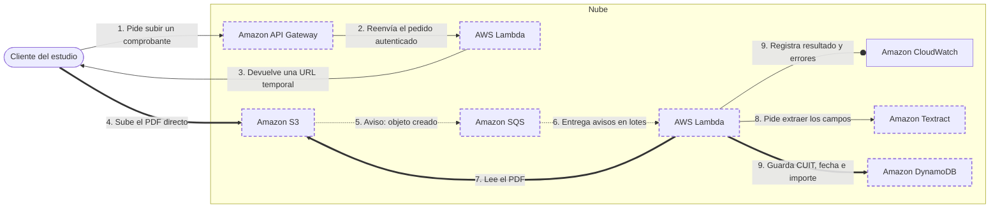

<!-- Archivo generado por pnpm content:gen a partir de scenario.yaml. No se edita a mano. -->

# Comprobantes en PDF para un estudio contable

> ⚠️ **Spoilers:** esta ficha contiene las respuestas del escenario. Si lo querés jugar, no sigas leyendo.

Los clientes suben comprobantes desde la web y el sistema extrae CUIT, fecha e importe automáticamente.

| Campo | Valor |
|---|---|
| Id | `serverless-pdf-processing` |
| Versión | 1 |
| Estado | beta |
| Nivel | 200 |
| Áreas | `serverless`, `storage`, `integration` |
| Duración estimada | 10 min |
| Autores | @elissamburu |
| Paleta | auto (máx. 14) |

## Contexto

Un estudio contable quiere que sus clientes suban **comprobantes en PDF** desde una web.
De cada comprobante hay que extraer **CUIT, fecha e importe** y guardarlos para
consultarlos después por cliente y por fecha.

El uso es muy desparejo: en los últimos días del mes llegan miles de comprobantes
en pocas horas y el resto del mes hay días enteros sin actividad.

El equipo técnico son dos personas que programan bien, pero no quieren operar
infraestructura y no tienen experiencia en aprendizaje automático.

## Objetivos

| Id | Tipo | Categoría | Objetivo |
|---|---|---|---|
| `no-servers` | Restricción | operations | No administrar servidores, sistemas operativos ni parches. |
| `no-ml-team` | Restricción | team | El equipo no puede entrenar ni operar modelos de aprendizaje automático propios. |
| `sporadic-traffic` | Meta | traffic | Picos fuertes a fin de mes y días enteros sin uso. |
| `low-cost` | Meta | cost | Pagar lo mínimo posible cuando no hay actividad. |
| `no-lost-files` | Meta | durability | Ningún comprobante se puede perder; si el procesamiento falla, debe reintentarse. |

## Diagrama con las respuestas óptimas

Los casilleros tienen borde punteado.

## Respuestas

### Casillero `api-entry`

> Punto de entrada HTTPS que recibe los pedidos del navegador, valida el token y los pasa a la lógica.

| Servicio | Grado | Objetivos | Justificación | Referencias |
|---|---|---|---|---|
| Amazon API Gateway (`apigateway`) | 🟢 Óptimo | `no-servers`, `sporadic-traffic`, `low-cost` | Un API administrado cobra por pedido, escala solo en los picos, no cuesta nada en los días sin uso y puede validar el token del usuario antes de invocar la lógica. | [1](https://docs.aws.amazon.com/apigateway/latest/developerguide/http-api.html) |
| Application Load Balancer (`alb`) | 🟠 Aceptable | `low-cost`, `sporadic-traffic` | Un balanceador de aplicaciones puede invocar funciones como destino y no requiere servidores, pero tiene un cargo por hora aunque no llegue ningún pedido: en un sistema con días enteros sin uso pagás capacidad ociosa. | [1](https://docs.aws.amazon.com/elasticloadbalancing/latest/application/lambda-functions.html) |
| Amazon Route 53 (`route53`) | 🔴 Incorrecto | — | Resuelve nombres DNS hacia un destino; no recibe ni procesa pedidos HTTP. |  |
| Amazon EC2 (`ec2`) | 🔴 Incorrecto | viola `no-servers` | Podrías montar un servidor web, pero tendrías que administrar el sistema operativo y los parches. |  |

Pistas:

1. Pensá en un servicio que cobre por pedido y no por hora.
2. Tiene que poder validar la identidad del usuario antes de ejecutar la lógica.

### Casillero `url-signer`

> Lógica breve que verifica al usuario y genera una URL temporal para subir el archivo directo al almacenamiento.

| Servicio | Grado | Objetivos | Justificación | Referencias |
|---|---|---|---|---|
| AWS Lambda (`lambda`) | 🟢 Óptimo | `no-servers`, `sporadic-traffic`, `low-cost` | Es una tarea de milisegundos que corre solo cuando hay pedidos: cómputo por evento, sin servidores, que escala en el pico y no cobra cuando no se usa. | [1](https://docs.aws.amazon.com/lambda/latest/dg/welcome.html) [2](https://docs.aws.amazon.com/AmazonS3/latest/userguide/using-presigned-url.html) |
| AWS Fargate (`fargate`) | 🟠 Aceptable | `low-cost`, `sporadic-traffic` | Correr contenedores sin administrar servidores cumple la restricción, pero para una tarea tan corta tenés que elegir entre tareas siempre encendidas (costo ocioso) o esperar el arranque de un contenedor en cada pico. | [1](https://docs.aws.amazon.com/AmazonECS/latest/developerguide/AWS_Fargate.html) |
| Amazon EC2 (`ec2`) | 🔴 Incorrecto | viola `no-servers` | Funciona, pero implica administrar instancias, sistema operativo y escalado. |  |

Pistas:

1. La tarea dura milisegundos y ocurre solo cuando alguien quiere subir un archivo.

### Casillero `upload-store`

> Almacenamiento durable donde el navegador sube el PDF original usando la URL temporal.

| Servicio | Grado | Objetivos | Justificación | Referencias |
|---|---|---|---|---|
| Amazon S3 (`s3`) | 🟢 Óptimo | `no-lost-files`, `low-cost`, `no-servers` | Almacenamiento de objetos diseñado para alta durabilidad, pago por lo guardado, con URLs prefirmadas para subir directo desde el navegador y notificaciones cuando se crea un objeto. | [1](https://docs.aws.amazon.com/AmazonS3/latest/userguide/using-presigned-url.html) [2](https://docs.aws.amazon.com/AmazonS3/latest/userguide/EventNotifications.html) |
| Amazon EFS (`efs`) | 🔴 Incorrecto | — | Es un sistema de archivos que se monta desde cómputo; el navegador no puede subir directo con una URL temporal. |  |
| Amazon EBS (`ebs`) | 🔴 Incorrecto | viola `no-servers` | Es un disco en bloque que se conecta a una instancia; requiere un servidor y no admite subidas desde el navegador. |  |
| Amazon DynamoDB (`dynamodb`) | 🔴 Incorrecto | — | Es una base clave-valor con ítems de hasta 400 KB; no está pensada para guardar archivos. |  |

Pistas:

1. Buscá almacenamiento de objetos, no de archivos ni de bloques.

### Casillero `event-buffer`

> Buffer que desacopla la llegada de archivos del procesamiento: retiene los avisos y permite reintentos.

| Servicio | Grado | Objetivos | Justificación | Referencias |
|---|---|---|---|---|
| Amazon SQS (`sqs`) | 🟢 Óptimo | `no-lost-files`, `sporadic-traffic`, `low-cost` | Una cola retiene los mensajes hasta que se procesan, los vuelve a entregar si el procesamiento falla, permite una cola de mensajes fallidos y deja que el consumidor los tome en lotes a su ritmo. Cobra por pedido. | [1](https://docs.aws.amazon.com/lambda/latest/dg/with-sqs.html) |
| Amazon EventBridge (`eventbridge`) | 🟠 Aceptable | `sporadic-traffic` | Un bus de eventos puede enrutar el aviso de "objeto creado" con reintentos, pero entrega por push: te da menos control del ritmo de consumo y del procesamiento por lotes durante un pico que una cola. | [1](https://docs.aws.amazon.com/eventbridge/latest/userguide/eb-what-is.html) |
| Amazon Kinesis Data Streams (`kinesis-data-streams`) | 🟠 Aceptable | `low-cost` | Un stream retiene y permite reprocesar, pero está pensado para flujos continuos de alto volumen y tiene un costo base por capacidad aunque no lleguen datos. | [1](https://docs.aws.amazon.com/streams/latest/dev/introduction.html) |
| Amazon SNS (`sns`) | 🔴 Incorrecto | — | Publica y empuja mensajes a suscriptores, pero no los retiene para que el consumidor los tome a su ritmo. Para tener buffer se combina con una cola. |  |

Pistas:

1. Necesitás que los avisos esperen si el procesador está ocupado o falla.
2. El consumidor debería poder leerlos en lotes.

### Casillero `processor`

> Lógica que toma cada aviso, lee el PDF, coordina la extracción de datos y guarda el resultado.

| Servicio | Grado | Objetivos | Justificación | Referencias |
|---|---|---|---|---|
| AWS Lambda (`lambda`) | 🟢 Óptimo | `no-servers`, `sporadic-traffic`, `low-cost` | Se integra de forma nativa con la cola (lee en lotes, reintenta y escala con la cantidad de mensajes), no cobra en los días sin uso y el tiempo máximo de ejecución alcanza para procesar un comprobante. | [1](https://docs.aws.amazon.com/lambda/latest/dg/with-sqs.html) |
| AWS Fargate (`fargate`) | 🟠 Aceptable | `low-cost`, `sporadic-traffic` | Serviría para procesamientos largos o pesados, pero acá cada comprobante se procesa rápido y tendrías que gestionar el escalado de tareas según la cola. | [1](https://docs.aws.amazon.com/AmazonECS/latest/developerguide/AWS_Fargate.html) |
| Amazon EC2 (`ec2`) | 🔴 Incorrecto | viola `no-servers` | Implica administrar instancias y un grupo de autoescalado atado a la cola. |  |

Pistas:

1. Es la misma familia de cómputo que ya usaste para la URL temporal.

### Casillero `extractor`

> Servicio administrado que detecta texto, pares clave-valor y tablas en documentos escaneados.

| Servicio | Grado | Objetivos | Justificación | Referencias |
|---|---|---|---|---|
| Amazon Textract (`textract`) | 🟢 Óptimo | `no-ml-team`, `no-servers` | Extrae texto, formularios y tablas de documentos sin entrenar modelos, y tiene una API específica para facturas y recibos que devuelve campos normalizados. | [1](https://docs.aws.amazon.com/textract/latest/dg/invoices-receipts.html) |
| Amazon Bedrock (`bedrock`) | 🟠 Aceptable | `low-cost` | Un modelo fundacional multimodal puede extraer campos con un prompt y sirve si los formatos varían mucho, pero el resultado es menos determinista, exige validación adicional y suele costar más para una extracción estructurada y repetitiva. | [1](https://docs.aws.amazon.com/bedrock/latest/userguide/what-is-bedrock.html) |
| Amazon Rekognition (`rekognition`) | 🔴 Incorrecto | — | Analiza imágenes y video; detecta texto en imágenes, pero no está pensado para documentos con formularios ni para PDFs de varias páginas. |  |
| Amazon SageMaker AI (`sagemaker-ai`) | 🔴 Incorrecto | viola `no-ml-team` | Te permitiría entrenar y operar un modelo propio de extracción, justo lo que el equipo no puede hacer. |  |

Pistas:

1. Buscá un servicio de IA ya entrenado, especializado en documentos.

### Casillero `results-db`

> Base de datos para guardar los campos extraídos y consultarlos por cliente y por fecha.

| Servicio | Grado | Objetivos | Justificación | Referencias |
|---|---|---|---|---|
| Amazon DynamoDB (`dynamodb`) | 🟢 Óptimo | `no-servers`, `sporadic-traffic`, `low-cost` | Con capacidad bajo demanda cobra por pedido y escala sola. El patrón de acceso es simple (cliente como clave de partición, fecha como clave de ordenamiento) y no hay conexiones que administrar desde funciones. | [1](https://docs.aws.amazon.com/amazondynamodb/latest/developerguide/on-demand-capacity-mode.html) |
| Amazon Aurora (`aurora`) | 🟠 Aceptable | `low-cost`, `sporadic-traffic` | Una base relacional administrada conviene si hubiera reportes o consultas ad hoc complejas, pero suma gestión de esquema, manejo de conexiones desde funciones y un costo base mayor para un acceso tan simple. | [1](https://docs.aws.amazon.com/AmazonRDS/latest/AuroraUserGuide/CHAP_AuroraOverview.html) |
| Amazon Redshift (`redshift`) | 🔴 Incorrecto | — | Es un data warehouse para análisis sobre grandes volúmenes, no para guardar y leer registros individuales por pedido. |  |
| Amazon ElastiCache (`elasticache`) | 🔴 Incorrecto | — | Es una caché en memoria para acelerar lecturas; no es el almacén principal y durable de los datos. |  |

Pistas:

1. El acceso siempre es por cliente y rango de fechas: clave y orden.

## Referencias

- [Patrones de arquitecturas orientadas a eventos](https://aws.amazon.com/event-driven-architecture/)
