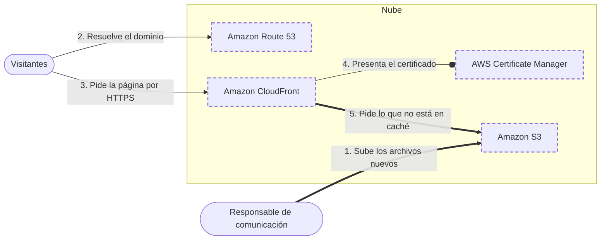

<!-- Archivo generado por pnpm content:gen a partir de scenario.yaml. No se edita a mano. -->

# El sitio institucional de una ONG, seguro y rápido en todo el mundo

> ⚠️ **Spoilers:** esta ficha contiene las respuestas del escenario. Si lo querés jugar, no sigas leyendo.

Un sitio estático con dominio propio y HTTPS, para visitantes de todo el mundo, sin servidores y al menor costo posible.

| Campo | Valor |
|---|---|
| Id | `static-website-https` |
| Versión | 1 |
| Estado | draft |
| Nivel | 100 |
| Áreas | `networking`, `storage` |
| Duración estimada | 5 min |
| Autores | @elissamburu |
| Paleta | auto |

## Contexto

Una **ONG** tiene un sitio institucional hecho solo con archivos estáticos: páginas HTML,
hojas de estilo, imágenes y algunos PDF. No hay formularios ni base de datos.

El sitio tiene que abrirse con el **dominio propio** de la organización (con y sin `www`)
y siempre por **HTTPS**. Lo visitan donantes y voluntarios de **todo el mundo**.

La ONG no tiene equipo de sistemas: una persona de comunicación sube los archivos nuevos
cada tanto. El presupuesto es mínimo y el tráfico, bajo.

## Objetivos

| Id | Tipo | Categoría | Objetivo |
|---|---|---|---|
| `no-servers` | Restricción | operations | Nadie en la organización puede administrar servidores, sistemas operativos ni parches. |
| `https-own-domain` | Restricción | security | El sitio se sirve solo por HTTPS y con el dominio propio de la organización, también sin www. |
| `global-audience` | Meta | latency | Visitantes de todo el mundo: la página tiene que cargar rápido aunque estén lejos de donde se guardan los archivos. |
| `low-cost` | Meta | cost | Costo mínimo: con poco tráfico, pagar por uso y no por capacidad reservada. |

## Diagrama con las respuestas óptimas

Los casilleros tienen borde punteado.

## Respuestas

### Casillero `dns`

> Servicio que resuelve el dominio propio, incluso sin www, hacia la red que entrega el sitio.

| Servicio | Grado | Objetivos | Justificación | Referencias |
|---|---|---|---|---|
| Amazon Route 53 (`route53`) | 🟢 Óptimo | `https-own-domain`, `low-cost`, `no-servers` | DNS administrado que permite un registro de tipo alias tanto para el dominio raíz (sin www) como para subdominios, algo que un CNAME no permite en la raíz. Las consultas alias hacia la red de distribución no tienen cargo. | [1](https://docs.aws.amazon.com/Route53/latest/DeveloperGuide/routing-to-cloudfront-distribution.html) |
| AWS Global Accelerator (`global-accelerator`) | 🔴 Incorrecto | — | Da direcciones IP estáticas que dirigen tráfico hacia balanceadores o instancias; no aloja los registros DNS del dominio. |  |

Pistas:

1. Alguien tiene que traducir el nombre del dominio a una dirección.
2. Buscá un servicio de DNS que pueda apuntar el dominio raíz (sin www) a un recurso de AWS.

### Casillero `certificate`

> Emisión y renovación del certificado TLS del dominio propio que se presenta a los visitantes.

| Servicio | Grado | Objetivos | Justificación | Referencias |
|---|---|---|---|---|
| AWS Certificate Manager (`acm`) | 🟢 Óptimo | `https-own-domain`, `low-cost`, `no-servers` | Emite certificados públicos sin costo para usarlos con servicios integrados y los renueva automáticamente. Para usarlo con la red de distribución, el certificado se pide en la región US East (N. Virginia), us-east-1. | [1](https://aws.amazon.com/certificate-manager/pricing/) [2](https://docs.aws.amazon.com/acm/latest/userguide/managed-renewal.html) [3](https://docs.aws.amazon.com/AmazonCloudFront/latest/DeveloperGuide/cnames-and-https-requirements.html) |
| AWS KMS (`kms`) | 🔴 Incorrecto | — | Crea y controla claves para cifrar datos; no emite certificados TLS para un dominio. |  |
| AWS Secrets Manager (`secrets-manager`) | 🔴 Incorrecto | — | Guarda y rota secretos de aplicaciones, como contraseñas o claves de API; no emite ni renueva certificados TLS públicos. |  |

Pistas:

1. Para HTTPS con tu dominio necesitás un certificado firmado por una autoridad reconocida.
2. Buscá un servicio que emita certificados públicos y los renueve solo.

### Casillero `edge`

> Red global que recibe los pedidos HTTPS en ubicaciones cercanas a cada visitante y guarda copias del sitio en caché.

| Servicio | Grado | Objetivos | Justificación | Referencias |
|---|---|---|---|---|
| Amazon CloudFront (`cloudfront`) | 🟢 Óptimo | `global-audience`, `https-own-domain`, `no-servers`, `low-cost` | Red de entrega de contenido: cada visitante es atendido desde la ubicación de borde con menor latencia, que guarda copias en caché. Acepta el dominio propio como nombre alternativo con su certificado y fuerza HTTPS. Cobra por transferencia y pedidos, y la transferencia desde el almacenamiento hacia ella no tiene cargo. | [1](https://docs.aws.amazon.com/AmazonCloudFront/latest/DeveloperGuide/Introduction.html) [2](https://docs.aws.amazon.com/AmazonCloudFront/latest/DeveloperGuide/cnames-and-https-requirements.html) |
| Application Load Balancer (`alb`) | 🔴 Incorrecto | — | Reparte pedidos entre instancias, direcciones IP o funciones dentro de una región: no guarda copias cerca de los visitantes ni puede usar el almacenamiento de objetos como destino. |  |
| AWS Global Accelerator (`global-accelerator`) | 🔴 Incorrecto | — | Acerca el tráfico por la red de AWS, pero sus destinos son balanceadores, instancias o IP elásticas: no sirve archivos de un almacenamiento de objetos ni guarda copias en caché. |  |

Pistas:

1. Buscá algo que guarde copias del sitio cerca de cada visitante.
2. Es una red de entrega de contenido (CDN).

### Casillero `site-store`

> Almacenamiento privado y durable de los archivos del sitio: HTML, CSS, imágenes y PDF.

| Servicio | Grado | Objetivos | Justificación | Referencias |
|---|---|---|---|---|
| Amazon S3 (`s3`) | 🟢 Óptimo | `no-servers`, `low-cost` | Almacenamiento de objetos sin servidores, que cobra por lo guardado y lo transferido. El bucket puede quedar privado: solo la red de distribución lo lee, con control de acceso al origen. Servido directamente como sitio web no soporta HTTPS, por eso va detrás de la red de distribución. | [1](https://docs.aws.amazon.com/AmazonS3/latest/userguide/WebsiteEndpoints.html) [2](https://docs.aws.amazon.com/AmazonCloudFront/latest/DeveloperGuide/private-content-restricting-access-to-s3.html) [3](https://aws.amazon.com/s3/pricing/) |
| Amazon EC2 (`ec2`) | 🔴 Incorrecto | viola `no-servers` | Podrías montar un servidor web, pero alguien tendría que administrar el sistema operativo, los parches y la disponibilidad. |  |
| Amazon EBS (`ebs`) | 🔴 Incorrecto | viola `no-servers` | Es un disco en bloque que se conecta a una instancia: para servir el sitio necesitarías un servidor. |  |
| Amazon EFS (`efs`) | 🔴 Incorrecto | viola `no-servers` | Es un sistema de archivos que se monta desde cómputo: para servir los archivos por HTTP necesitarías un servidor. |  |

Pistas:

1. Los archivos del sitio son objetos: se suben y se leen enteros.
