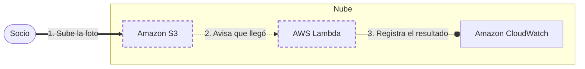

<!-- Archivo generado por pnpm content:gen a partir de scenario.yaml. No se edita a mano. -->

# Fotos de un club de barrio

> ⚠️ **Spoilers:** esta ficha contiene las respuestas del escenario. Si lo querés jugar, no sigas leyendo.

Los socios suben fotos y el sistema genera miniaturas.

| Campo | Valor |
|---|---|
| Id | `club-photos` |
| Versión | 1 |
| Estado | beta |
| Nivel | 100 |
| Áreas | `serverless`, `storage` |
| Duración estimada | 5 min |
| Autores | @autora |
| Paleta | auto · extra: Amazon DynamoDB |

## Contexto

Un club quiere que los socios suban fotos de los partidos.
El uso es esporádico.

## Objetivos

| Id | Tipo | Categoría | Objetivo |
|---|---|---|---|
| `no-servers` | Restricción | operations | No administrar servidores. |
| `low-cost` | Meta | cost | Pagar poco cuando no hay uso. |

## Diagrama con las respuestas óptimas

Los casilleros tienen borde punteado.

## Respuestas

### Casillero `store`

> Almacenamiento durable donde quedan las fotos originales.

| Servicio | Grado | Objetivos | Justificación | Referencias |
|---|---|---|---|---|
| Amazon S3 (`s3`) | 🟢 Óptimo | `no-servers`, `low-cost` | Almacenamiento de objetos durable con pago por uso. | [1](https://docs.aws.amazon.com/AmazonS3/latest/userguide/Welcome.html) |
| Amazon EFS (`efs`) | 🔴 Incorrecto | — | Se monta desde cómputo; no recibe subidas. |  |

Pistas:

1. Pensá en objetos, no en archivos.

### Casillero `thumbnailer`

> Lógica breve que genera la miniatura cuando llega una foto.

| Servicio | Grado | Objetivos | Justificación | Referencias |
|---|---|---|---|---|
| AWS Lambda (`lambda`) | 🟢 Óptimo | `no-servers`, `low-cost` | Cómputo por evento que no cobra sin uso. | [1](https://docs.aws.amazon.com/lambda/latest/dg/welcome.html) |
| AWS Fargate (`fargate`) | 🟠 Aceptable | `low-cost` | Contenedores sin servidores, pero con arranque más lento. |  |
| Amazon EC2 (`ec2`) | 🔴 Incorrecto | viola `no-servers` | Hay que administrar instancias. |  |
