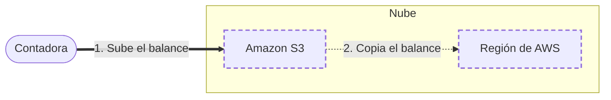

<!-- Archivo generado por pnpm content:gen a partir de scenario.yaml. No se edita a mano. -->

# Copias de un estudio contable

> ⚠️ **Spoilers:** esta ficha contiene las respuestas del escenario. Si lo querés jugar, no sigas leyendo.

Un estudio guarda los balances de sus clientes y quiere una copia lejos de la original.

| Campo | Valor |
|---|---|
| Id | `regional-backup` |
| Versión | 1 |
| Estado | beta |
| Nivel | 100 |
| Áreas | `storage` |
| Duración estimada | 5 min |
| Autores | @autora |
| Paleta | auto · extra: Amazon DynamoDB |

## Contexto

Un estudio contable guarda los balances de sus clientes.
Si un desastre natural afecta la zona donde están los archivos, no puede perderlos.

## Objetivos

| Id | Tipo | Categoría | Objetivo |
|---|---|---|---|
| `survive-disaster` | Restricción | durability | Los archivos sobreviven a un desastre que afecte a toda una zona geográfica. |
| `low-cost` | Meta | cost | Pagar solo por lo que se guarda. |

## Diagrama con las respuestas óptimas

Los casilleros tienen borde punteado.

## Respuestas

### Casillero `store`

> Almacenamiento durable donde quedan los balances originales.

| Servicio | Grado | Objetivos | Justificación | Referencias |
|---|---|---|---|---|
| Amazon S3 (`s3`) | 🟢 Óptimo | `low-cost` | Almacenamiento de objetos durable con pago por uso. | [1](https://docs.aws.amazon.com/AmazonS3/latest/userguide/Welcome.html) |
| Amazon EFS (`efs`) | 🔴 Incorrecto | — | Se monta desde cómputo; no recibe archivos de la contadora. |  |

### Casillero `copy-site`

> Lugar geográfico lejano donde se guarda la segunda copia.

| Servicio | Grado | Objetivos | Justificación | Referencias |
|---|---|---|---|---|
| Región de AWS (`region`) | 🟢 Óptimo | `survive-disaster` | Está aislada geográficamente de la original: un desastre no afecta a las dos. | [1](https://docs.aws.amazon.com/whitepapers/latest/aws-overview/global-infrastructure.html) |
| Zona de disponibilidad (`availability-zone`) | 🔴 Incorrecto | viola `survive-disaster` | Está en la misma zona geográfica que la original: un desastre grande puede afectar a las dos. |  |
